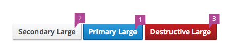

# Button Guidelines

In an effort to bring further consistency to button interaction patterns we are proposing the following guidelines around styling, color, and usage examples.

## Styling

  - Button language should be clear without the use of an icon.
  - Using an icon in a button should be reserved for specific use cases.
  - Buttons should be of equal height. Varying button height can be distracting to the user and give inadvertent importance of one button over another. Do not combine differing sizes within the same row.
  - Three sizes of buttons are offered.
    1. Default.
    1. Large.
    1. Extra Small.

## Color

  - There are four different button colors with specific meanings:
    1. Primary button blue: Use for primary call to action on page/modal. Each page should have one clear call to action. There is an accessibility reason being that on enter the primary button should be enacted. It's possible that there could be no primary action button on a page.
    1. Secondary button gray: This will be the majority of the buttons used in an application. Any button that exists on a page that isn't a primary call to action should use this color.
    1. Destructive button red: This color should be reserved for highly destructive actions only. Most "Delete" or "Cancel" functions are not highly destructive. Evaluation should be done to agree that a button meets the highly destructive criteria.
    1. Disabled button : A button that could become enabled, but is currently not available should use this state.

## Usage Examples

  1. Close button:
    - If closing a modal, follow the [Modal Widget](https://www.patternfly.org/pattern-library/widgets/#modal) guidelines.
    - If referring to closing another type of view use "Close" as a secondary button.
  1. Delete button:
   - "Delete" should be used in a secondary button unless you have a limited use case where the Delete action is a highly destructive action. In that case, use the destructive button. Ideally, a delete button would be followed up with a confirmation modal for the user to confirm this action.
  1. Cancel button:
   - "Cancel" should be used in a secondary button unless you have a limited use case where the Cancel action is a highly destructive action. In that case, use the destructive button.
  1. Buttons within the toolbar (Above list view, table view, card view):
   - Refer to the [Toolbar Pattern](https://www.patternfly.org/pattern-library/forms-and-controls/toolbar/#_) and the guidelines above when formatting buttons in a toolbar above a content view.
  1. Buttons within a modal:
   - Refer to the [Modal Widget](https://www.patternfly.org/pattern-library/widgets/#modal) and the guidelines above when formatting buttons in a modal.
  1. Buttons within a wizard:
   - Refer to the [Wizard Pattern](https://www.patternfly.org/pattern-library/communication/wizard/#/_design) and the guidelines above when formatting buttons in a wizard.
  1. Buttons within a form:
   - Refer to the [Form Pattern](https://www.patternfly.org/pattern-library/forms-and-controls/forms/#_) and the guidelines above when formatting buttons in a form.
