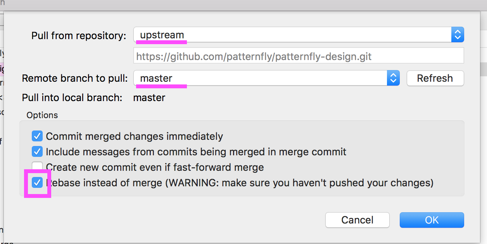
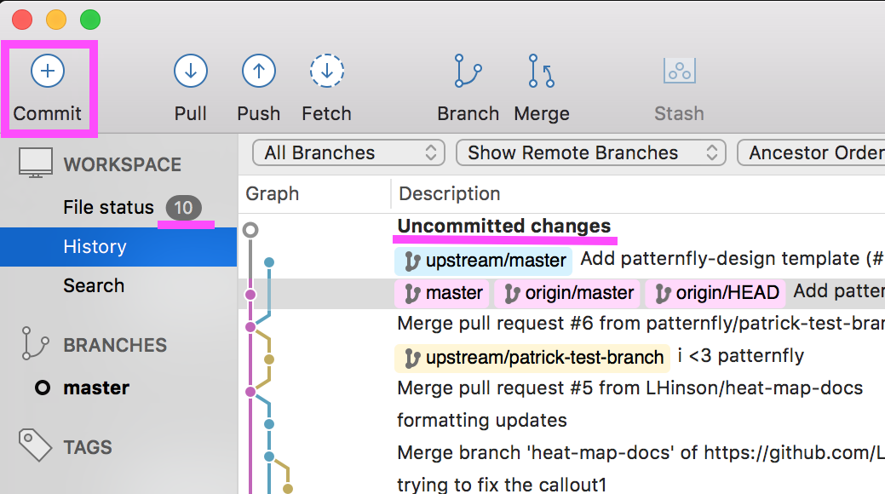
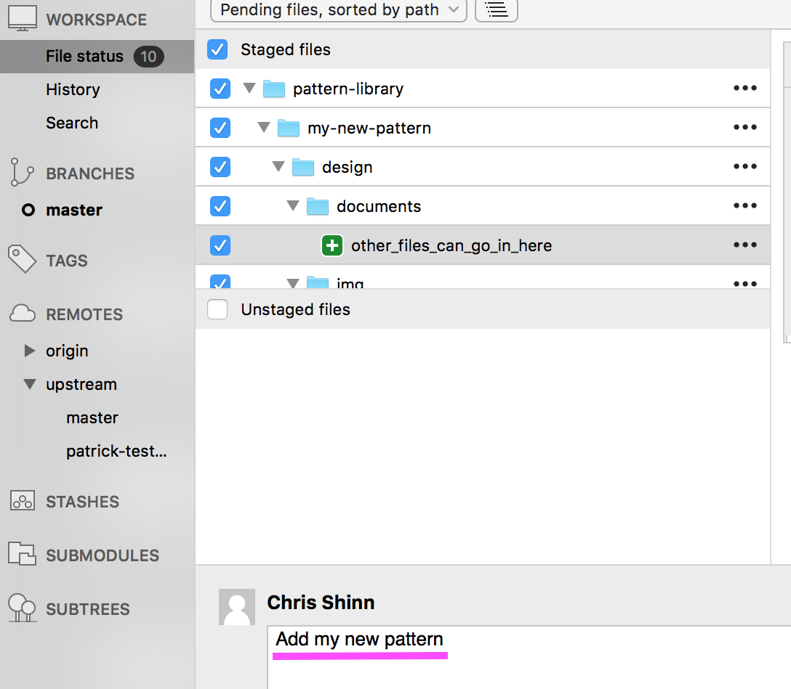
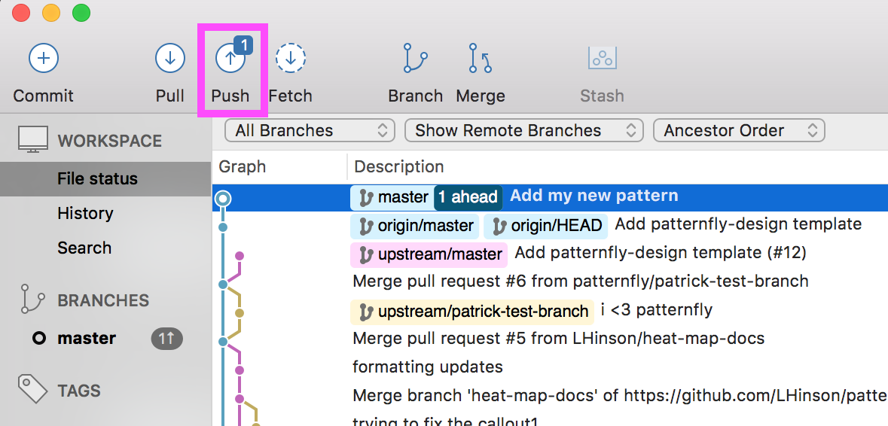
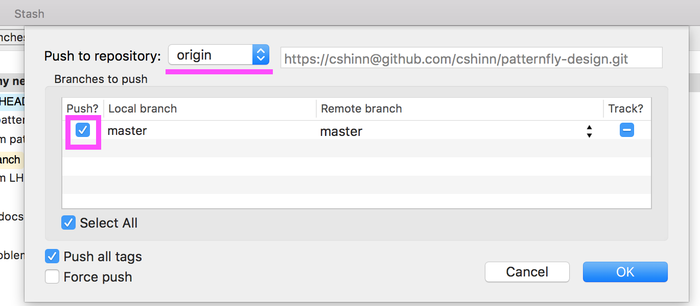
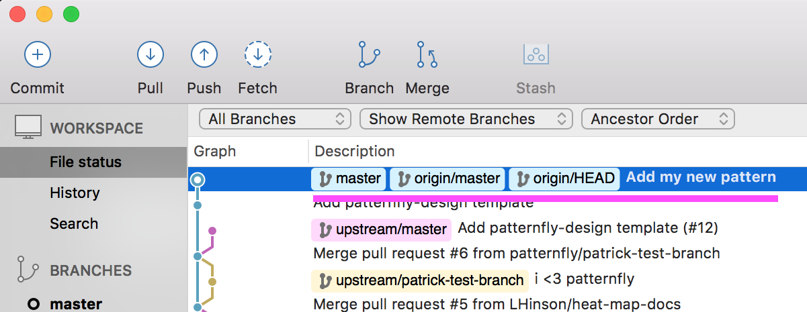
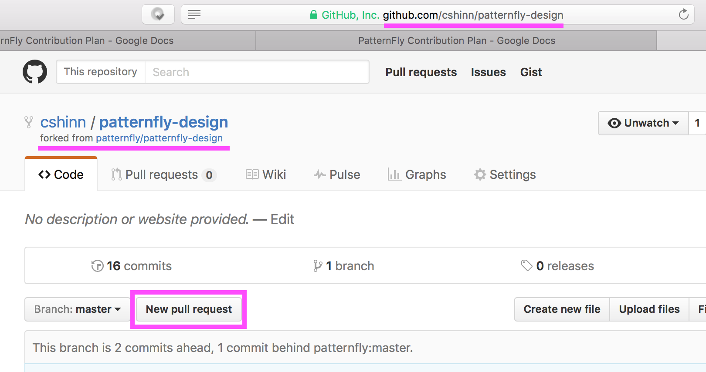
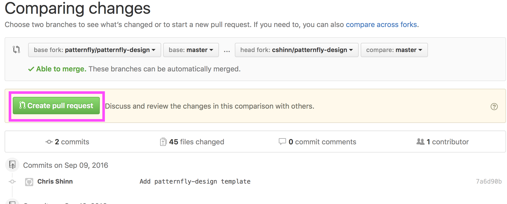

## Contribution Workflow (do this whenever want to add or edit something)

### Get up to date
1. Make sure that your local repository is selected, and click “Pull”

1. A modal will pop up. Where is says, “Pull from repository”, select “upstream” from the drop down menu. Where it says “Remote branch to pull:” select “master” from the drop down menu. Check the box that says “Rebase instead of merge”

### Create or update the pattern
We recommend using Atom to edit .md files. You can reference the GitHub Markdown files for help formatting.
1. Use Finder to open up your patternfly-design folder
1. Locate the folder for the pattern you hope to edit under pattern-library
  - If the folder does not exist, copy the pattern-template folder, paste it in the relevant location, and rename it
1. Add and edit the relevant files and images. Feel free to discard example and placeholder content from the pattern-template folder.

### Commit (save) your changes
1. Click on the “Commit” button in the toolbar

1. Check the boxes next to any files that you wish to include (checking “unstaged files” will automatically move them all over) They will move from “Unstaged files” into “Staged files”

1. Add a description (usually 55 characters or fewer) of your edits.
1. Click Commit
1. Click “Push”

1. A modal will pop up, make sure “origin” is selected where it says “Push to repository” and select the branch you wish to push then click “OK”

1. You should then see that your local and remote (origin) repos are synchronized.

### Create a Pull Request (submit your changes to Patternfly)
1. Open your fork of patternfly-design on GitHub at `https://github.com/<yourgithubusername>/patternfly-design`
1. Click “New pull request”

1. Click “Create a Pull Request”, add a comment if relevant.

