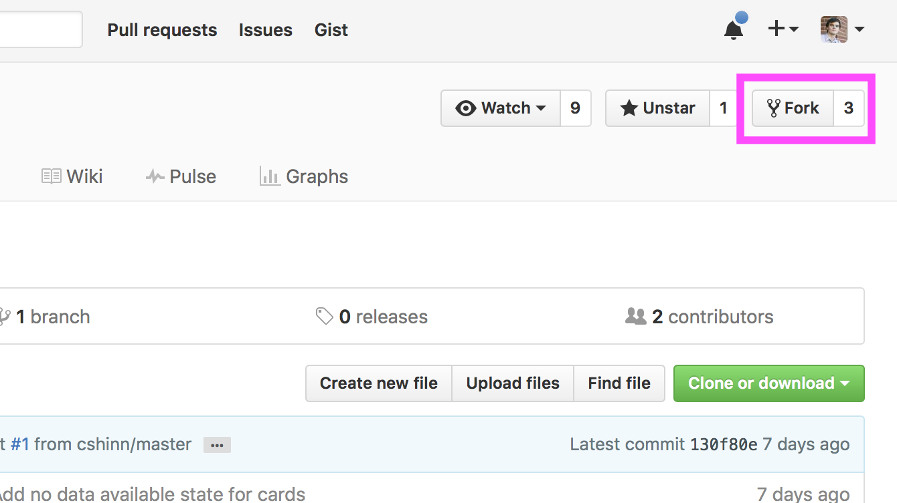
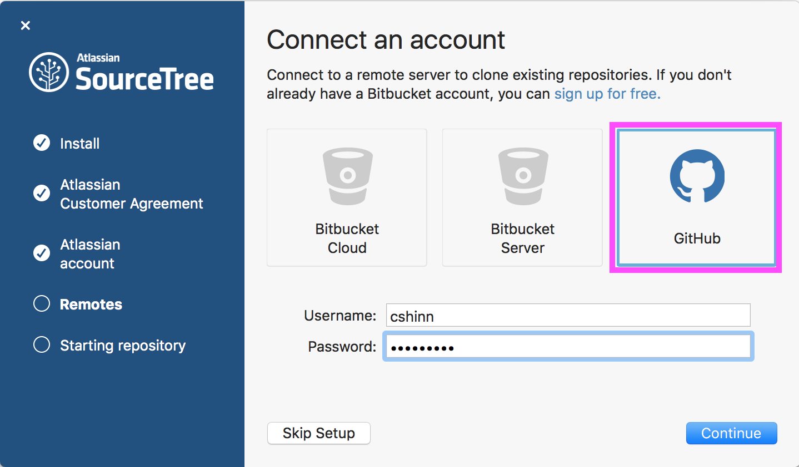
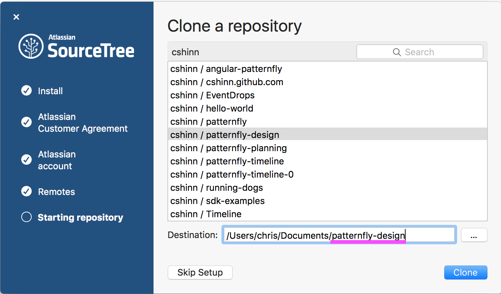
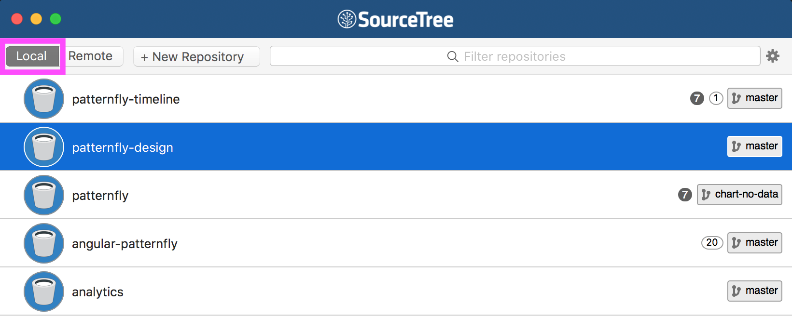
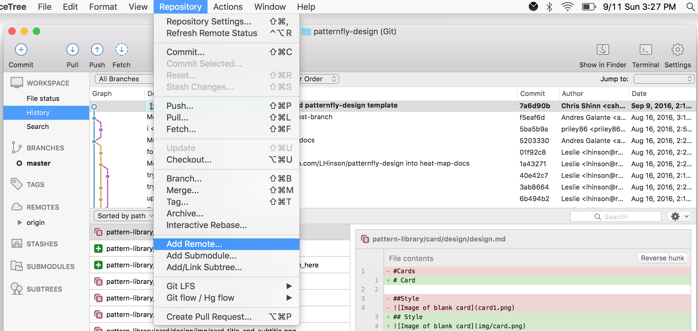
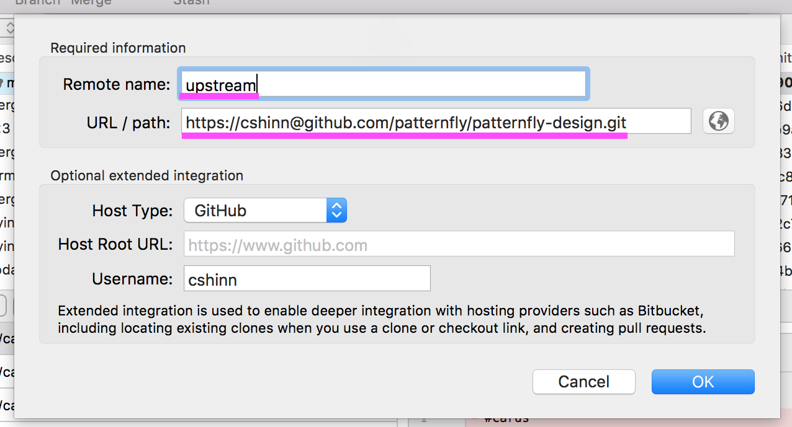
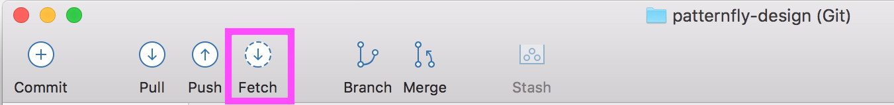

## Set up your environment (do this part once)

### GitHub
1. First, you will need to register for an account on [GitHub](https://www.github.com) or sign in.
1. [Go to the PatternFly-Design Repo on GitHub](https://www.github.com/patternfly/patternfly-design)
1. Click on Fork in the top right
  - If it asks “Where should we fork this repository?”, you will want to fork it to your personal GitHub account

### SourceTree
1. [Download SourceTree](https://www.sourcetreeapp.com)
1. Open the SourceTree App (create an account if necessary or sign in with google using your Red Hat email. Your Jira accout will not work)
1. On the Connect an account page, select GitHub and sign in with your github credentials, then click Continue

1. On the Clone a repository page, scroll until you see the line named `<yourgithubusername>/patternfly-design` and select it.
1. In the Destination field, type or browse for the folder in which you would like to store your local copy of patternfly-design. Next, Click Clone.

1. SourceTree will present you with a list of your repositories. Make sure you are on the “Local” tab and double click on your patternfly-design repository.

1. Go to `Repository > Add Remote`

  - Name it “upstream” (Make sure to use lowercase) and paste in the URL `https://github.com/patternfly/patternfly-design.git`
  - Note: Upstream is the main repository and origin is your fork

1. Click on the Fetch button then click “OK”

#### You ready to start making contributions!
#### [Read the contribution workflow guide here](contribution.md)
