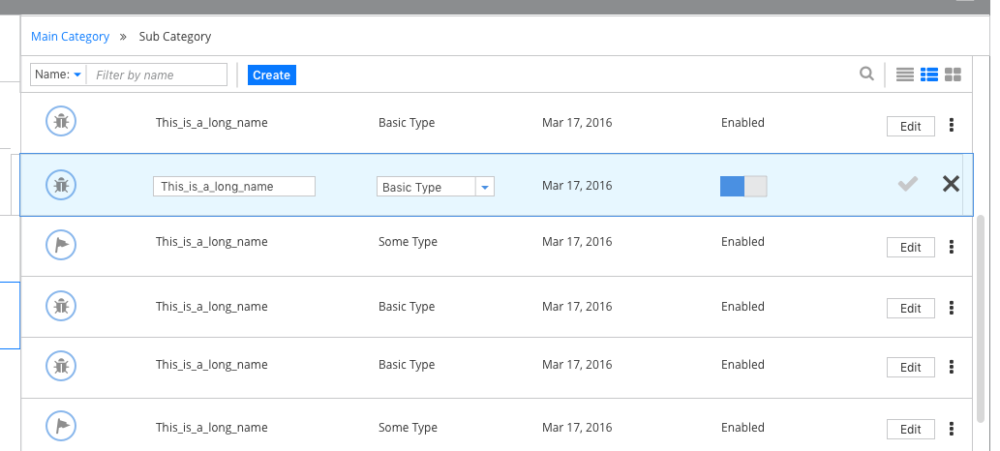

# In-Line Edit

## Overview

In-line Edit can be used in conjunction with a List View or a Table view to allow the user to create or edit an item without navigating to another view.  Use this when all editable elements can be viewed within the row or expanded row. In-line Edit saves the user the need to open a modal window or navigate to a new view for simple object creation or edit actions.  

* Only one row in a list or a table can be edited at a time.  Users commit to or cancel changes by clicking **Save** or **Cancel**.

* Items can be added to the top of a list or a table by including an **Add** or **Create** action.  

## In-Line Edit for List view

## In-Line Edit for Table view

## Restrictions
1. This pattern applies to List and Table content views.
2. If drill-down behavior is supported, this pattern should not be used.
3. This pattern does not include bulk actions (editing multiple rows at once).
