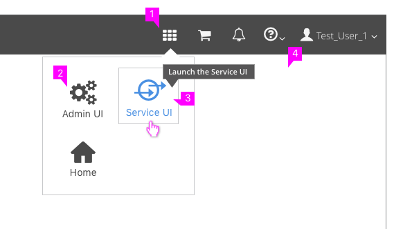
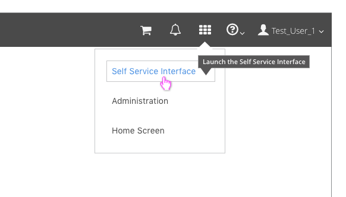

# Application Launcher

## Properties

  1. **App Launcher Icon:** The "fa-th" icon from the Font Awesome icon library should be used to represent the Application launcher. Clicking on the icon will open a menu allowing the user to select a different interface to launch.  
  2. **Menu Items:**  The menu is triggered by clicking on the app launcher icon. The menu displays the available user interfaces. The presentation of this menu may vary. In this example, user interfaces are represented with a label (UI name) and associated icon (optional) however, you could also use a list. The current interface being used should not show up in the menu. Home is optional, but when used should send the user to a generic landing page with all UI options and links to product documentation.
  3. **Selecting:** When a user hovers over the UI Name or Icon, both should be highlighted as links, with a button border appearing as well. Clicking the option will launch the selected UI in a new browser window or browser tab, based on the browser preferences of the user.
  4. **Tooltip:** As a user hovers over the UI Name or Icon, a [Tooltip](https://www.patternfly.org/pattern-library/widgets/#tooltip) should be available to explain what the action will do.

## Application Launcher Without Icons

