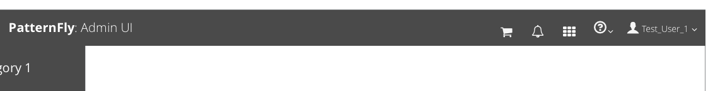
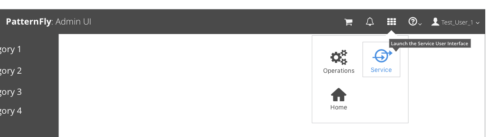

# Application Launcher

The Application Launcher should be used inside applications that have more than one interface available. This widget makes it easier for the user to switch between different user interfaces without logging out. If available, this launcher should be accessible from the [Masthead](https://www.patternfly.org/pattern-library/application-framework/masthead/#_) using the Launcher icon detailed in the Design tab.

