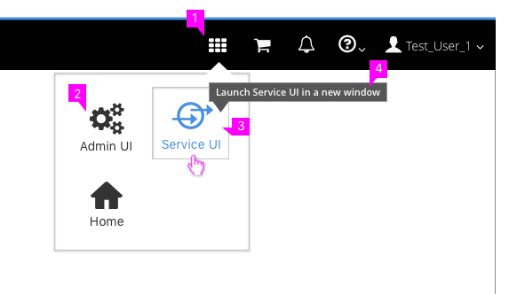

# Application Selector

## Selector Properties

  1. **App Selector Icon:** The "fa-th" icon from the Font Awesome icon library should be used to represent the Application selector. Clicking on the icon will open a menu allowing the user to select a different Interface to launch.  
  2. **UI Name and Icon:** Each available user interface should be identified with an icon and label below that icon. The current interface being used should not show up in the menu. Home should always be an option and should send the user to a generic landing page with all UI options and documentation.
  3. **Selecting:** When a user hovers over the UI Name or Icon, both should be highlighted as links, with a button border appearing as well. Clicking the option will launch the selected UI in a new browser window.
  4. **Tooltip:** As a user hovers over the UI Name or Icon, a [Tooltip](https://www.patternfly.org/pattern-library/widgets/#tooltip) should be available to explain what the action will do.
