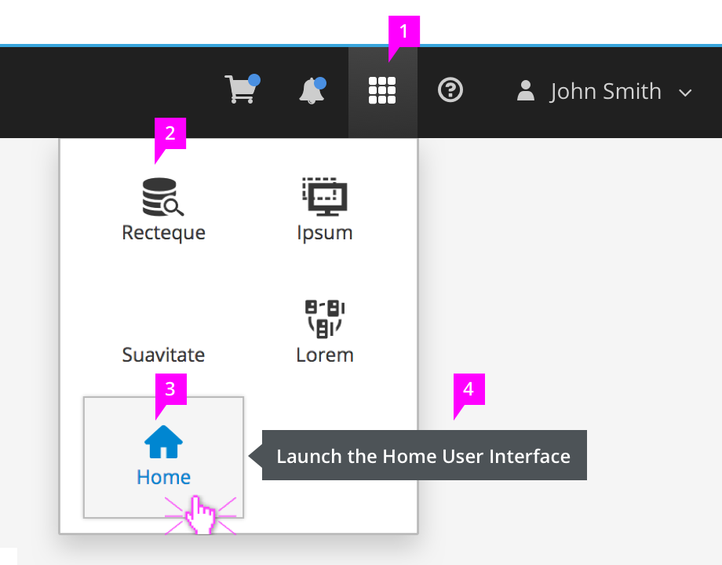
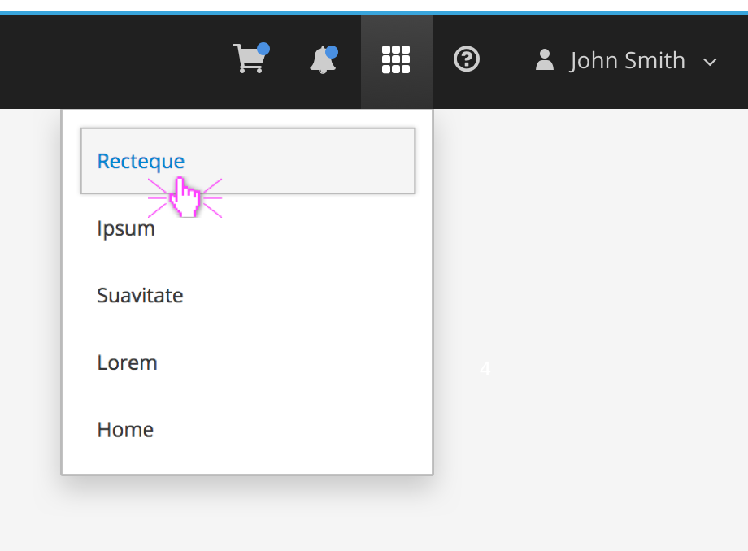
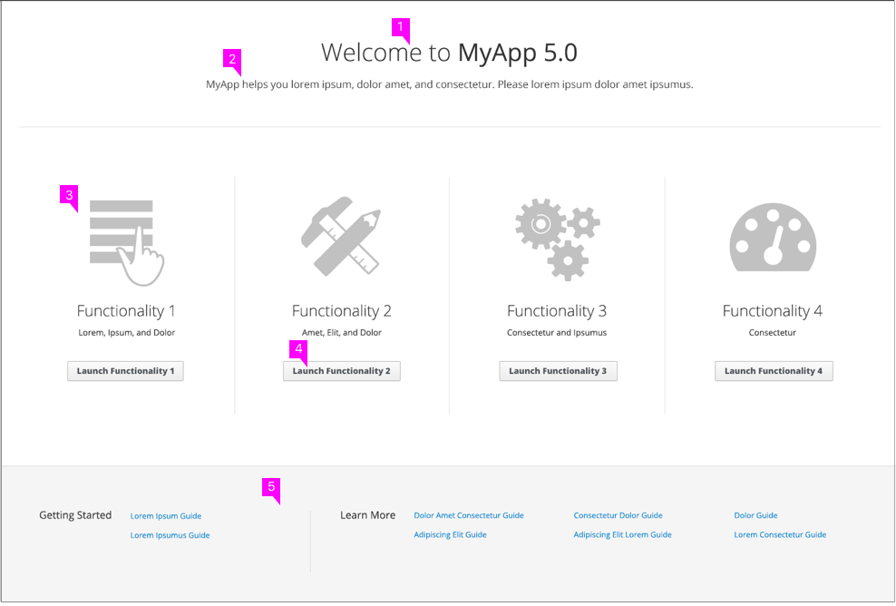

# Launcher

## Launcher Menu

  1. **Launcher Icon:** The "fa-th" icon from the Font Awesome icon library should be used to represent the launcher. Clicking on the icon will open a menu allowing the user to select a different interface to launch.  
  2. **Menu Items:**  The menu is triggered by clicking on the launcher icon. The menu displays the available user interfaces. The presentation of this menu may vary. In this example, user interfaces are represented with a label (UI name) and associated icon (optional); however, you could also use a list. The current interface being used should not show up in the menu. Home is optional, but when used should send the user to the Launcher Home.
  3. **Selecting:** When a user hovers over the UI Name or Icon, both should be highlighted as links, with a button border appearing as well. Clicking the option will launch the selected UI in a new browser window.
  4. **Tooltip（Optional）:** As a user hovers over the UI Name or Icon, a [Tooltip](https://www.patternfly.org/pattern-library/widgets/#tooltip) should be available to explain what the action will do. The tooltip is optional and should only be used if more information is needed about the app that will be launched.

### Launcher Menu Without Icons

## Launcher Home

* The Launcher Home can be used as a landing page between the Login Screen and the main application functionality when multiple interfaces exist. It may also be navigated to through a link in the Launcher Menu.

1. **Page Title:** Give the page a name that encompasses all interface options.
2. **Description** (optional): Welcome users to the application and give a brief description of the menu items presented.
3. **Menu Items:** All available interfaces are represented with a label (UI name) and associated icon (optional). No more than four menu items should be displayed using the Launcher Home pattern.  
4. **Action Buttons:** Place an action button under each menu item to allow for launching each user interface. See the [Action Labels](http://www.patternfly.org/styles/terminology-and-wording/#terminology-and-wording-for-action-labels) section for more information about terminology and wording specific to action labels.
5. **Footer:** (optional) Provide links to any additional resources associated with the application that may be helpful to the user. Resources in the footer may include documentation, tutorials, guides, etc, and may be organized using vertical separators as needed.
