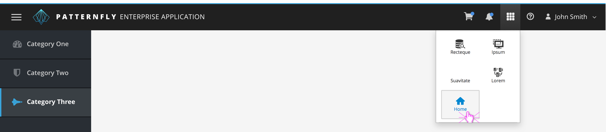
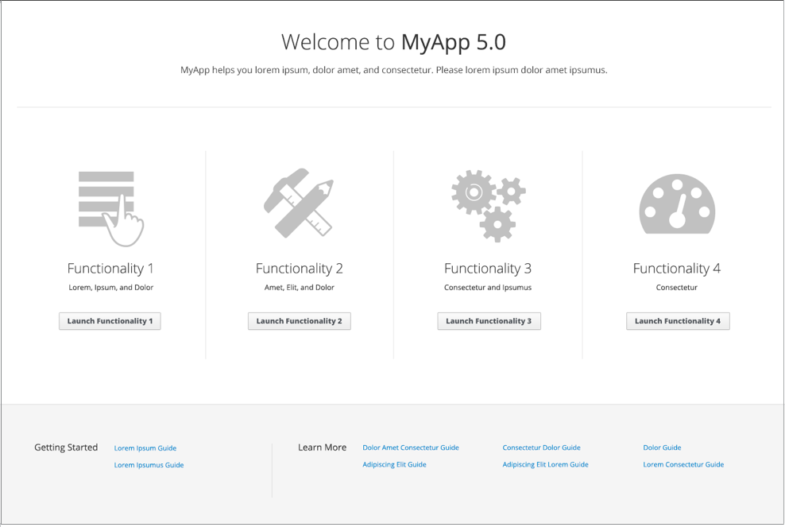

# Launcher

The Launcher allows users to see all available interfaces from one area of an application. This pattern makes it easier for users to quickly navigate to different interfaces without logging out. The pattern consists of two parts, the Launcher Menu and the Launcher Home (optional). Both parts display all available interfaces, with the Home screen also acting as a landing page for additional resources and documentation.

The Launcher Menu can be used without the Launcher Home, but the Launcher Home is recommended for any application that has between one and four interfaces available and has a need to provide additional context around functionality of those interface options.

The Launcher pattern is NOT meant to be an alternative to displaying [Vertical Navigation](http://www.patternfly.org/pattern-library/navigation/vertical-navigation/#_) or [Horizontal Navigation](http://www.patternfly.org/pattern-library/navigation/horizontal-navigation/#_).

The Launcher Menu should be accessible from the [Masthead](https://www.patternfly.org/pattern-library/application-framework/masthead/#_) using the Launcher icon detailed in the [Design tab](http://www.patternfly.org/pattern-library/application-framework/launcher/#/design).

The Launcher Home should be accessible from the Launcher Menu under the "Home" button.

