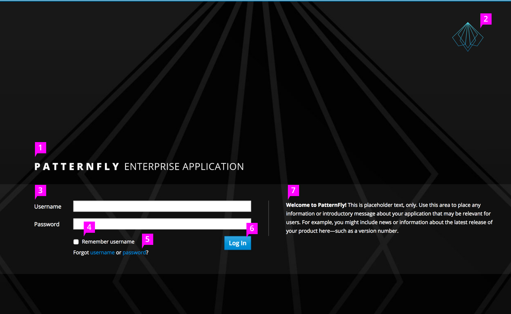
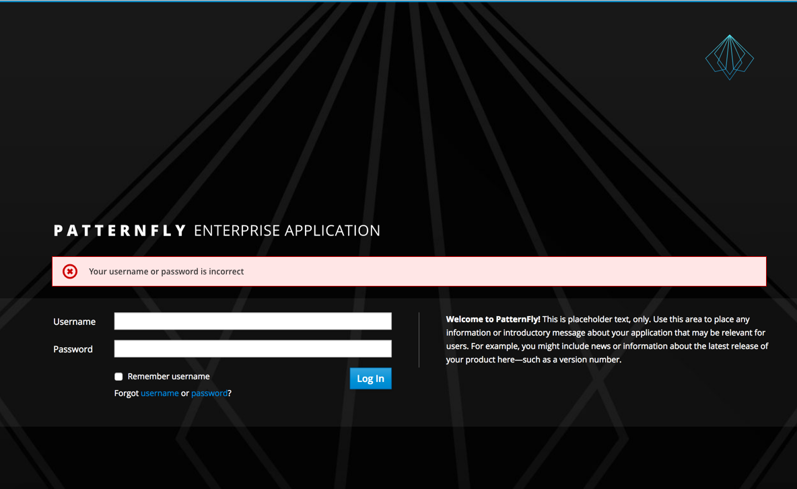
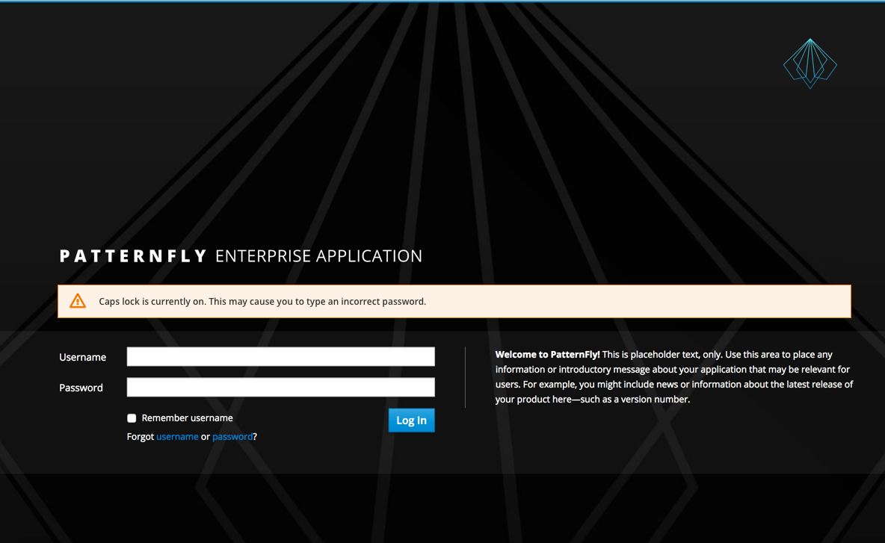
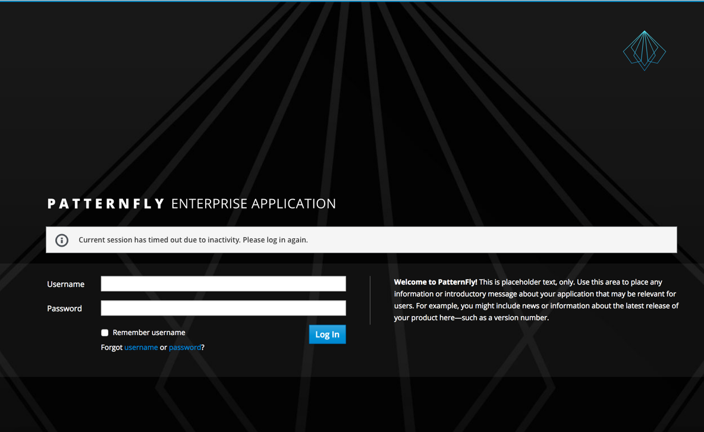

# Login Page

1. **Application Name:** The application or project name uses a combination of Open Sans Extra Bold and Open Sans Regular.

2. **Logo:** The logo is located in the top right.

3. **Required Fields:** The required fields include username (see the Terminology and Wording Style Guide) and password. Labels are left-aligned. Additional fields are optional. Some applications may require additional information beyond username and password (such as a specific server or geo-location).  In these cases, the additional fields can appear underneath the password field. The dialog will expand to accommodate the additional fields. The order of the additional fields will have to be addressed on a case-by-case basis, but they should sit between the Password field and the Log In button. Try and limit the number of fields to less than five. Also, you may use progressive disclosure if a field’s value is dependent on a field prior to it.

4. **Checkbox** (optional)**:** A “Remember Username” checkbox is located under the fields. For security reasons, we do not recommend allowing the user to remember their password. Check box labels should use sentence style capitalization (see the Terminology and Wording Style Guide for more information regarding capitalization).

5. **Help Link:** “Forgot Username or Password?” is a link for users to recover their username or password.

6. **Login Button:** The Login button appears underneath the password field. Please note, the label on the button should say “Log In”, a verb, vs Login, a noun or adjective (See the Terminology and Wording Style Guide for more information).

7. **Informational Text** (optional)**:** The text only area, located to the right of the fields, is available for additional information such as an introductory message about your application or you may want to include information about the latest release of your product here - such as a version number. Use text sparingly; do not overload this area with too much text.

## Notifications

[Inline Notifications](http://www.patternfly.org/pattern-library/communication/inline-notifications/#/api) are displayed below the application name and above the input fields when informational, warning, or errors messages are needed. If there are multiple strings, each message appears on its own line, and the area adjusts as needed to fit these messages.

Examples of these messages include the following:
1. **Error Message:** An error is triggered if the user incorrectly types their username or password. In this event, after the information has been submitted, the values entered for the username and other optional fields remains populated however, the value for the password is discarded.

2. **Warning Message:** A warning message is triggered if the user has the caps lock turned on. Once the caps lock is turned off, the warning should disappear.

3. **Informational Message:** An informational message is triggered if the user is timed out of the application. They will be returned to the login page, which will display an informational message explaining that the session timed out due to inactivity.

