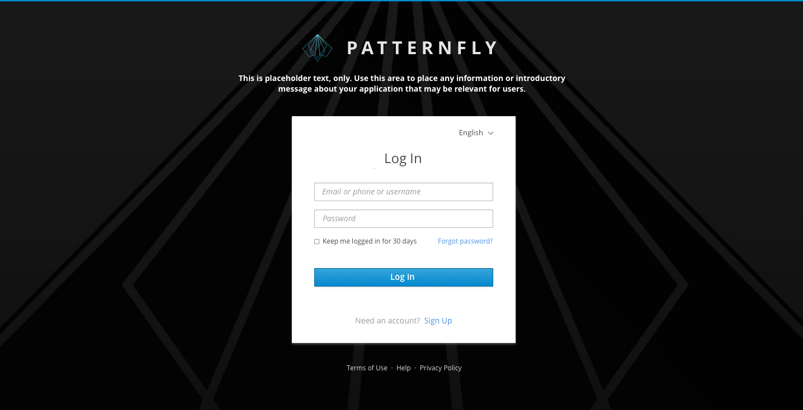
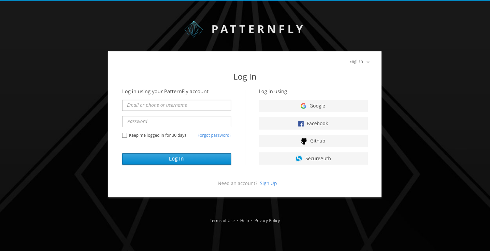

# Login Page

The login page allows a user to gain access to an application by entering their username and password or by authenticating using a social media login. For additional login methods, see:
- [Single Sign-On](https://www.patternfly.org/pattern-library/application-framework/single-sign-on/#)
- [Multi-Factor Login](https://www.patternfly.org/pattern-library/application-framework/multi-factor-login/#)

Usage scenarios related to the login page include:

* A user navigates to an application and is presented with a login page as a way to gain access to the application. There are two possible results:
  * Authentication is successful and the user is directed to the application landing page.
  * Authentication fails and the user remains on the login page. If authentication fails, the screen should show an informational or error message about the failure.
* A user is automatically logged out due to inactivity. In this event, they will be returned to the login page, which will display an informational message explaining what happened. Once the user logs in again, they should be taken back to the page they were previously on before being timed out. Thirty minutes is the suggested duration before a session timeout, but this is subject to change based on your product’s security requirements.
* A user has forgotten their username and/or password. A link is available to begin the process to reset this information. Once the user clicks on one of these links, the contents of the login page is replaced with fields specific to recovering their username and/or password. There are a number of different ways the user could recover their password. This pattern does not dictate which methods an application should follow. Some options include:
  * The user could provide their e-mail and be sent a temporary password or a link to reset their password.
  * The user could answer a security question.
  * The user could get a message explaining that they have to contact a specific person.

## Basic Login Page
This is a general layout of a common login screen. A user can input the username and the password together to log in.

## Social Login
Social login will allow a user to sign in with their social networks or IdPs accounts.

Please refer to branding guidelines when using logos for social login page. The following are examples of some of the more frequently used but you may use others as your needs require.

- [Facebook brand guidelines](https://en.facebookbrand.com/guidelines/brand)
- [Twitter brand guidelines](https://about.twitter.com/en_us/company/brand-resources.html)
- [Github brand guidelines](https://github.com/logos)
- [Stack Exchange brand guidelines](https://stackexchange.com/legal/trademark-guidance)
- [Google brand guidelines](https://developers.google.com/identity/branding-guidelines)
- [LinkedIn brand guidelines](https://brand.linkedin.com)
- [OpenID brand guidelines](http://openid.net/add-openid/logos/)
- [Instagram brand guidelines](https://en.instagram-brand.com)

