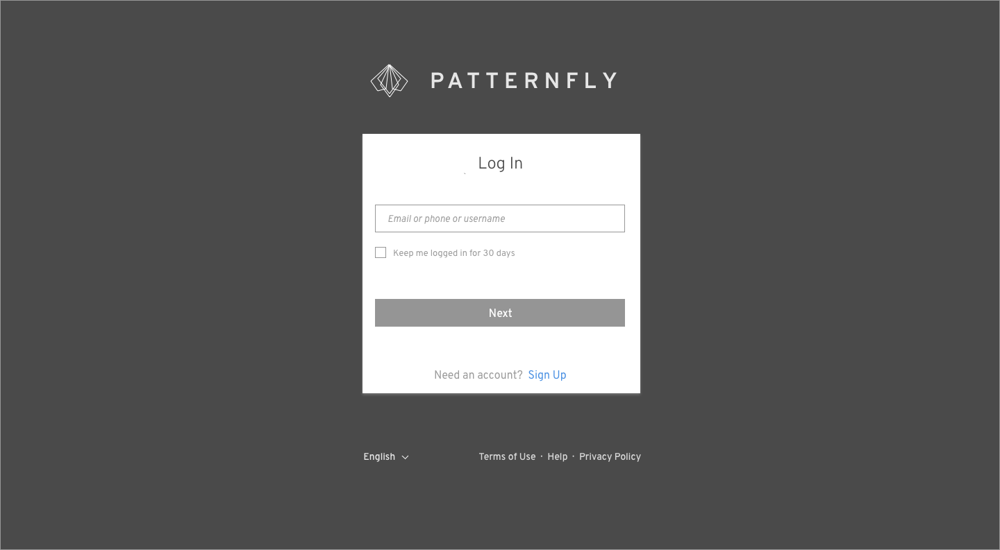
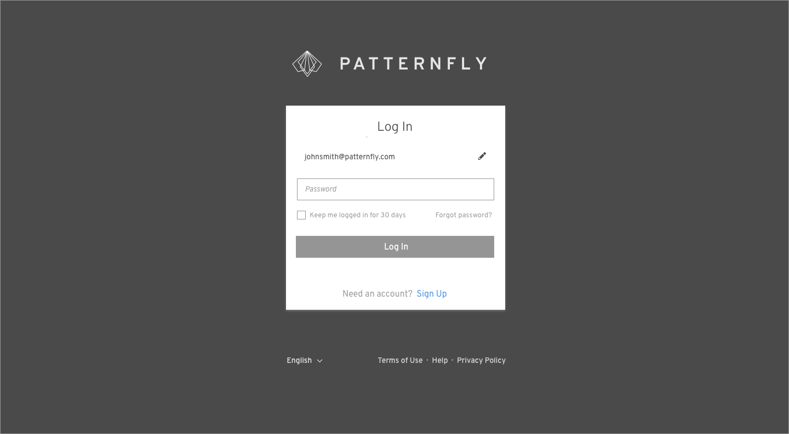

# Login Page

The login page allows the user to gain access to an application by entering their username and password. Usage scenarios related to the login page include:

* A user navigates to an application and is presented with a login page as a way to gain access to the application. There are two possible results:
  * Authentication is successful and the user is directed to the application landing page.
  * Authentication fails and the user remains on the login page. If authentication fails, the screen should show an informational or error message about the failure.
* A user is automatically logged out due to inactivity. In this event, they will be returned to the login page, which will display an informational message explaining what happened. Once the user logs in again, they should be taken back to the page they were previously on before being timed out. Thirty minutes is the suggested duration before a session timeout, but this is subject to change based on your product’s security requirements.
* A user has forgotten their username and/or password. A link is available to begin the process to reset this information. Once the user clicks on one of these links, the contents of the login page is replaced with fields specific to recovering their username and/or password. There are a number of different ways the user could recover their password. This pattern does not dictate which methods an application should follow. Some options include:
  * The user could provide their e-mail and be sent a temporary password or a link to reset their password.
  * The user could answer a security question.
  * The user could get a message explaining that they have to contact a specific person.

Jump to [Basic Login Page](#basic-login-page), [Identity First](#identity-first), [Social Login](#social-login), [SSO Login](#sso-login) or [Other Flows](#other-flows)

## Basic Login Page

## Identity First

## Social Login

## SSO Login

## Other Flows

