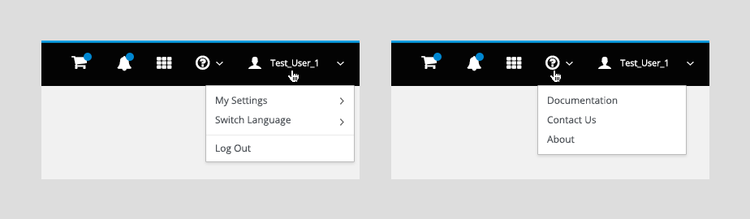

# Masthead

While there are two options for the masthead design, the order of information remains consistent regardless of whether you are using the tall or the short masthead design.

The masthead contains the following items from left to right:
  1. **Hamburger Menu:** The hamburger icon acts as a way for the user to open and close the vertical navigation panel. When using vertical navigation, we recommend always having the hamburger icon visible. When using horizontal navigation, the hamburger menu is only required on mobile devices.
  2. **Logo** (optional): When using the tall masthead design, there is space for a product logo to be placed to the left of the product title for additional branding.
  3. **Application Title:** The logo area is in the left corner and contains the application product name image file, in the form of a sized SVG graphic.
  4. **Product Specific Icons** (optional):
     * Some products may have additional requirements for the masthead, such as the shopping cart icon shown in the example above.
     * All icons that require badge updates should be grouped together in the masthead.
  5. **Notifications Icon** (optional):
     * If notifications or messages are being used, the "fa-bell" icon should be placed to the left of the Application Launcher icon. The bell icon is used for opening and closing the notification drawer. Jump to the [Notification Drawer](https://www.patternfly.org/pattern-library/communication/notification-drawer/#/api) pattern for additional details.
  6. **Application Launcher Icon** (optional):
     * If additional interfaces are available via an app selection panel, the "fa-th" icon from the Font Awesome icon library should be placed to the left of the help icon. Jump to the [Launcher](http://www.patternfly.org/pattern-library/application-framework/launcher/#/api) pattern for additional details.
  7. **Help Icon:**
     * The pficon-help icon should always be placed directly to the left of the user icon.
     * The dropdown arrow should appear to the right of the icon to indicate additional options below.
     * The dropdown items may vary, but any product documentation or helpful website links available to users should be listed here. This would also be the appropriate location for customer support links.
     * The dropdown should always include an "About" option that will launch the about modal for product version information. Jump to the [About Modal](https://www.patternfly.org/pattern-library/communication/about-modal/#/api) pattern for additional details.
  8. **User Icon:**
     * The username of the current logged in user should be listed to the right of the pficon-user icon and should always be in the top right corner of the masthead.
     * The dropdown arrow should appear to the right of the name to indicate additional options below.
     * The dropdown items may vary based on the user settings and permissions available, but this section should always include a "Log out" option at the bottom of the dropdown list.
     * If a [Language Selector](https://www.patternfly.org/pattern-library/forms-and-controls/language-selector/#/api) exists, it should appear in this dropdown menu as well.

## General Considerations

* **Badges:**
  - In some cases, badges may be used with the icons in the masthead to provide the user with additional information.
  - Badges should be blue with white text inside and should be placed to the top right corner of the icon it is associated with.
  - Some examples include showing new notifications are available, or showing the number of items currently in a shopping cart.
  - In responsive states, most masthead icons will be collapsed into the responsive state, but any icons that use badges should remain in the masthead for easier access.

* **Hamburger Menu:**
  - In smaller viewport sizes, the hamburger menu should list all primary navigation items, followed by the items from the masthead (except for badged items like notifications and shopping cart which should remain in the masthead if possible).
  - Masthead items should be listed based on their order in the masthead from left to right. For instance, based on the example images, the hamburger menu would be the following from top to bottom: Category 1, Category 2, Category 3, Help, User.
  - Any masthead options that have a dropdown should be displayed consistently with standard secondary navigation items.

* **Masthead Icons:**
  - The expand caret should be visible to the right side of an icon that has multiple options displayed in a list.
  - The icon color changes to white and has a light gray background to visually indicate when a user hovers or selects an icon from the Masthead.

