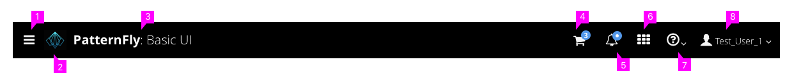
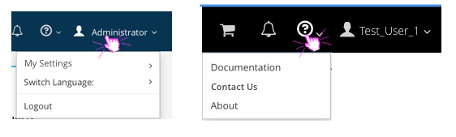

# Masthead

## Design

While there are two options for the masthead design, the order of information remains consistent regardless of whether you are using the tall or the short masthead design.

The masthead contains the following items from left to right:
  1. **Hamburger Menu** The hamburger icon acts as a way for the user to open and close the vertical navigation panel. When using vertical navigation, we recommend always having the hamburger icon visible. When using horizontal navigation, the hamburger menu is only required on mobile devices.
  2. **Product Logo (optional)** When using the tall masthead design, there is space for a product logo to be placed to the left of the product title for additional branding.
  3. **Title of Product** The logo area is in the left corner and contains the application product name image file, in the form of a sized SVG graphic.
  4. **Product Specific Icons (optional):**
    * Some product may have additional requirements for the masthead. For example, a shopping cart or a mechanism to switch/ launch additional applications.  
    * Any additional icons should be placed to the left of the user, help, and notifications icons.
  5. **Notifications Icon (optional):**
    * If notifications or messages are being used, the bell icon should be placed to the left of the help icon. The bell icon is used for opening and closing the notification drawer. Jump to the [Notification Drawer](https://www.patternfly.org/pattern-library/communication/notification-drawer/#/api) pattern for additional details.
  6. **Help Icon:**
    * The help icon should always be placed directly to the left of the user icon.
    * The dropdown arrow should appear to the right of the icon to indicate additional options below.
    * The dropdown items may vary, but any product documentation or helpful website links available to users should be listed here. This would also be the appropriate location for customer support links.
    * The dropdown should always include an "About" option that will launch the about modal for product version information. Jump to the "About" pattern for details.
  7. **User Icon:**
    * The username of the current logged in user should be listed to the right of the user icon and should always be in the top right corner of the masthead.
    * The dropdown arrow should appear to the right of the name to indicate additional options below.
    * The dropdown items may vary based on the user settings and permissions available, but this section should always include a "Logout" option at the bottom of the dropdown list.
    * If a language selector exists, it should appear in this dropdown menu as well.

## General Considerations

* **Badges:** In some cases, badges may be used with the icons in the masthead to provide the user with additional information. Badges should be blue with white text inside and should be placed to the top right corner of the icon it is associated with. Some examples include the number of new notifications available, or the number of items currently in a shopping cart.

* **Mobile View:** The hamburger menu should always be displayed on mobile devices. When opened, the menu should list all primary navigation items, followed by all items from the masthead. Masthead items should be listed based on their order in the masthead from left to right. For instance, based on the example images, the hamburger menu would be the following from top to bottom: Category 1, Category 2, Category 3, Shopping Cart, Notifications, Help, User.

* **Dropdown Options:** The expand carrot should be visible to the right side of any icon that has multiple options associated with it. For cases where clicking the icon will launch an action directly (for example, the notification drawer), the carrot should not be used.

