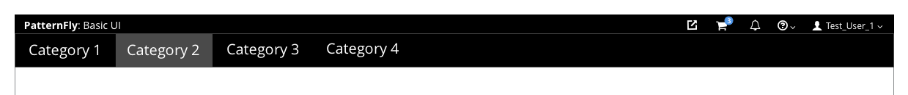
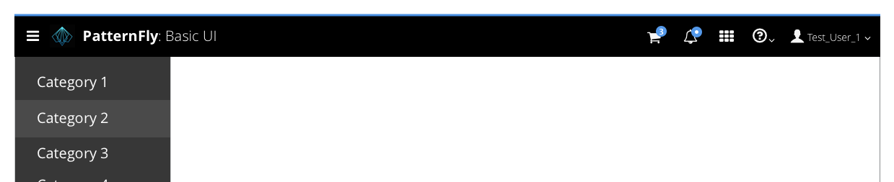

# Masthead

## Overview
There are two options for the masthead design, one short option to save space and one tall option to accommodate for larger product logos. The order of information remains consistent regardless of whether you are using the tall or the short masthead design.

## Short Option

The short design is recommended when using [Horizontal Navigation](https://www.patternfly.org/pattern-library/navigation/horizontal-navigation/#_) in order to reduce the vertical real estate. The hamburger menu should only be visible in the top left corner when the primary navigation is no longer visible with smaller viewport sizes.

## Tall Option

The tall design is recommended when using [Vertical Navigation](https://www.patternfly.org/pattern-library/navigation/vertical-navigation/#_). The hamburger menu should always be visible in the top left corner in this case.

The tall design should always be used when rebranding capabilities are desired, regardless of the navigation type.
