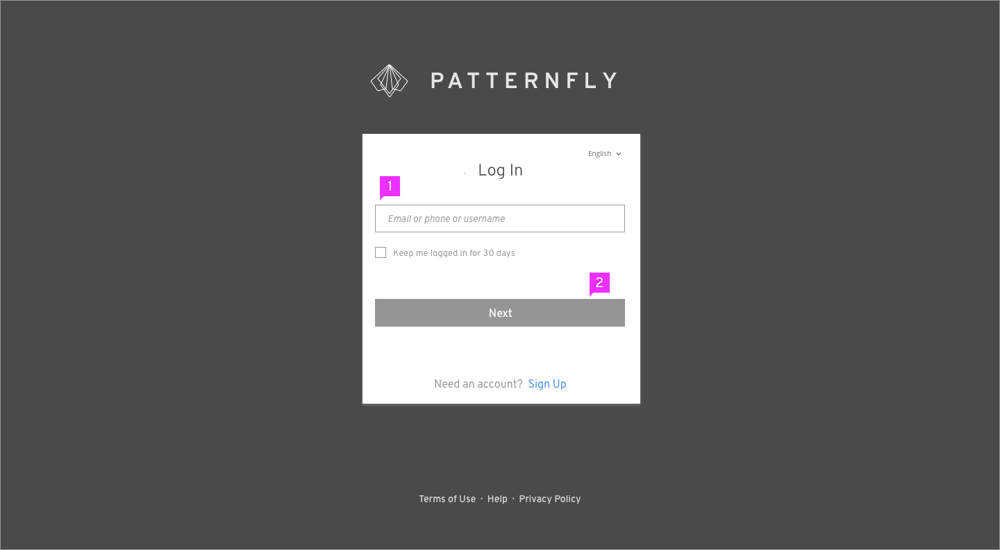
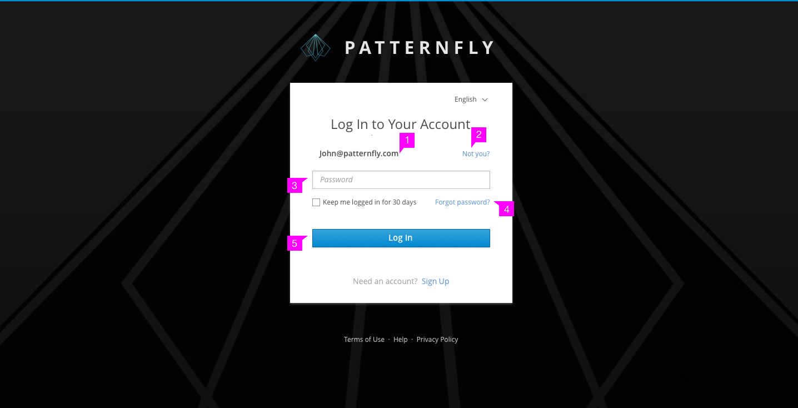
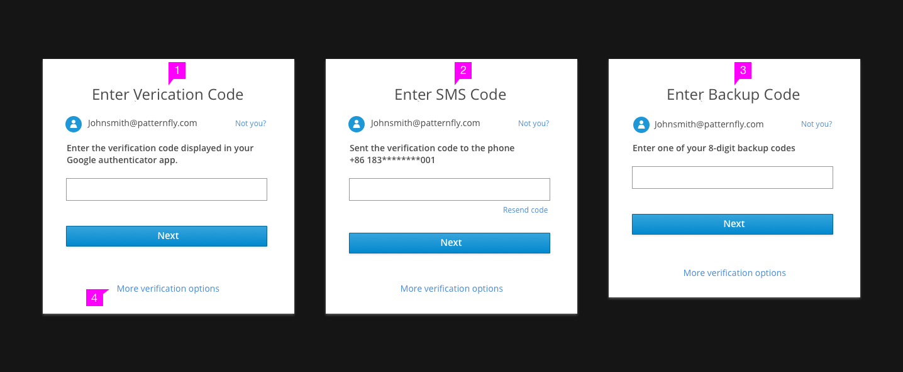
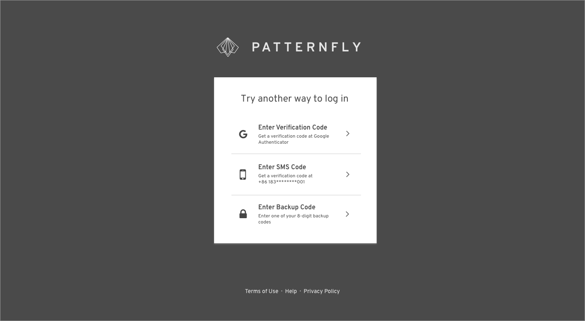

# Multi-Factor Login

## Identity First

1. **Logotype**: The product logo is placed at the top.
2. **Description** (optional): Description of the website can be placed here.
3. **Title**: The title is located at the top of the login card. "Your Account" can be replaced by the product name or any other term that makes sense for your application.
4. **Language Selector** (optional): The language selector is located in the top right of the login card.
5. **Username Field**: Include only a username field as the password will be requested in a separate step.
6. **Checkbox** (optional): Checkbox is located under the Required fields. It can be labeled varied texts depending on the needs of different applications. Checkbox labels should be capitalized according to [Terminology and Wording Style Guide](http://www.patternfly.org/styles/terminology-and-wording/).
7. **Next Button**: Replace "Log In" with "Next" since this will be a two step process. When the user clicks the "Next" button, the software will validate that this user exists and they will then be prompted to enter a password. If this user does not exist, an error message should be returned.
8. **Sign up** (optional): The page will jump to the sign up flow after clicking the “Sign up” link.
9. **Links** (optional): You may add any additional links to pages where the user can get more information or help.

1. **Validated Username**: After successful verification, the username should change to read-only mode in this page.
2. **Return Link**: Users can change username by clicking the "Not you?" link on the far right. After clicking the link, the card will return to the text field mode as the previous page.
3. **Password Field**: If needed, users should input password to log in.
4. **Help Link** (optional): It is a link for users to recover their password.
5. **Login Button**: If there are more steps for authentication, the button should be called “Next” instead of “Log In”.

## Other Login Methods

1. **Verification Code**: User can bind the authenticator which installed on their mobile phones with their accounts in registration process. If so, they can login with the code that authenticators provide.
2. **SMS Code**: Users can bind their phone number (or backup phone numbers) with their accounts in registration process. If so, they can login with SMS.
3. **Backup Code**: A backup code (random strings) can be provided to users in registration process. If so, they can login with backup code.
4. **More Verification Options**: Users can switch between different methods through this link if they can't finish the current one. The link will lead to followed screen.

