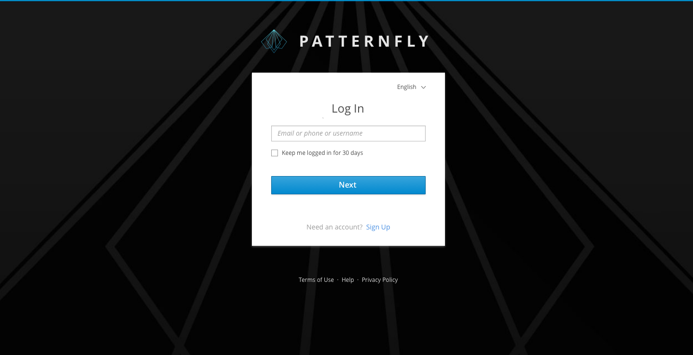
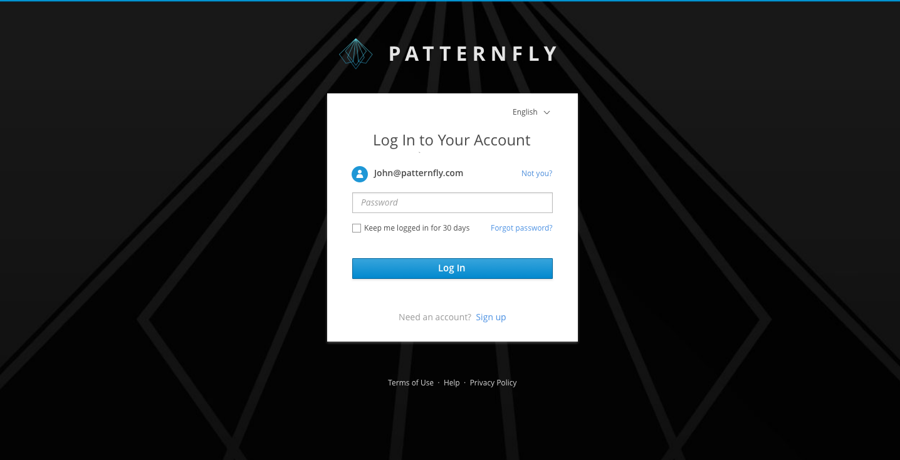
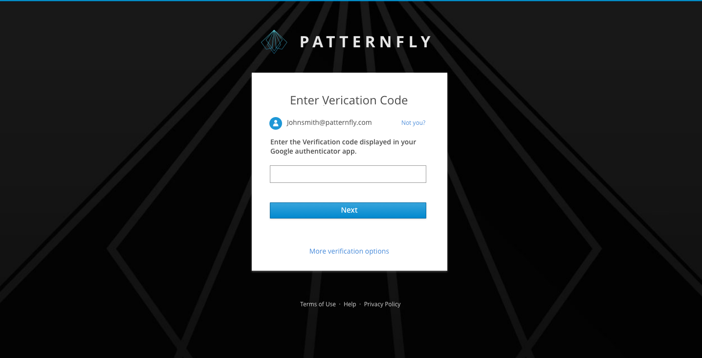
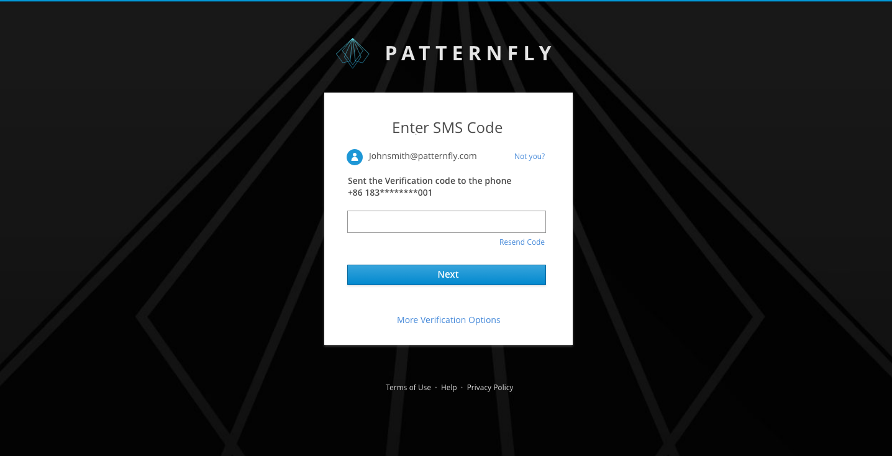
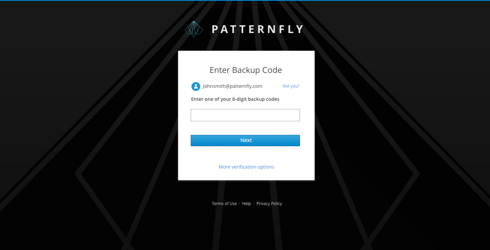

# Multi-Factor Login

The multi-factor login allows a user to gain access to an application by entering their authentication information step by step, such as username and password. For additional login methods, see:
- [Login Page](https://www.patternfly.org/pattern-library/application-framework/login-page/#)
- [Single Sign-On](https://www.patternfly.org/pattern-library/application-framework/single-sign-on/#)

## Identity First
For identity first, a user will input the username and password separately and may not be required to enter a password if other authentication mechanisms are used (for example fingerprint, two-way ssl, etc.). Also, it allows automatically redirecting to an external IdP when the user is linked to an external IdP.

#### Step 1 ####

#### Step 2 ####

## Additional Authentication Methods
Besides a password, additional information may be required if the user has enabled multi-factor authentication. The additional information could be an authentication code, a SMS code or a backup code.

### Authenticator Login
User can bind the authenticator which installed on their mobile phones with their accounts. If so, they can login with the code that authenticators provide.

### SMS Login
Users can bind their phone numbers (or backup phone numbers) with their accounts. If so, they can login with SMS codes.

### Backup Code Login
Backup codes (random strings) can be provided to users as an alternative authentication method. Users can login with backup codes instead of authentication codes or SMS codes.

