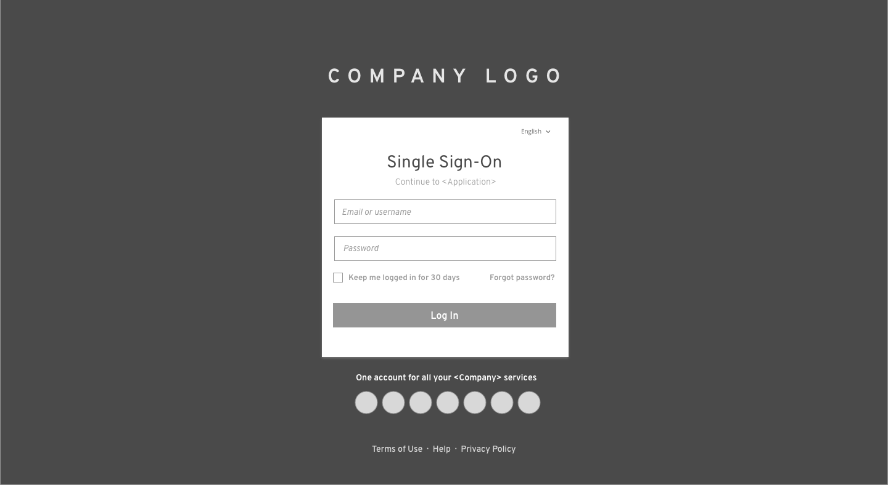

# Single Sign-On (SSO)

SSO (single sign-on) will allow a user to sign on once and access multiple applications within the same organization. For additional login methods, see:
- [Login Page](https://www.patternfly.org/pattern-library/application-framework/login-page/#)
- [Multi-Factor Login](https://www.patternfly.org/pattern-library/application-framework/multi-factor-login/#)

