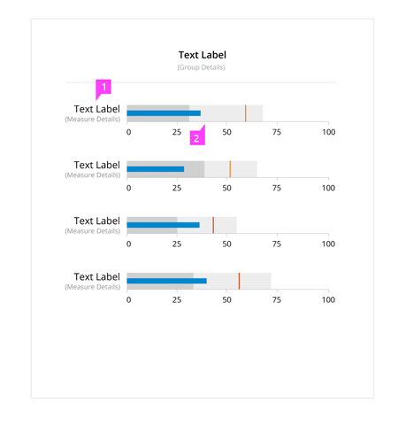

# Bullet Chart

## Overview

The most common use case for the bullet graph, an alternate to meters and gauges, is the comparison of one featured measure to one or more related measures within qualitative ranges. The bullet graph features one primary measure (e.g., year-to-date revenue), and one or more comparative measures (e.g., a target number, last year's revenue) displayed on a scale containing two to five qualitative ranges (e.g., poor, good, excellent).

## Examples

### Horizontal Chart

### Vertical Chart

### Alternative Variations

