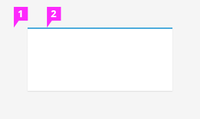
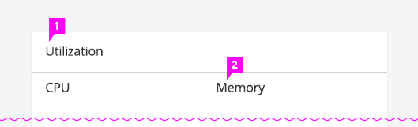
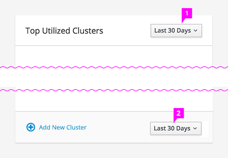
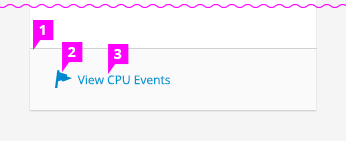
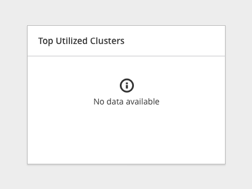

# Card

## Style

1. **Background and Borders:** All cards in a dashboard or content view should have the same background and border treatment.
1. **Top Accent** (optional)**:** Add a top accent to a row of cards to give them visual hierarchy.

## Titles

1. **Title** (optional)**:** If the content of the card is not obvious, add a title to clarify what information is being presented. The title is always followed by a horizontal separator.
1. **Subtitle** (optional)**:** Add a subtitle if the card contains the same visualization for different object types.

## Time Frame Filter (optional)

There are two options for where the time frame filter may be placed:

1. if there is a card title, the filter should be displayed on the right of the title panel.
1. if there is an action panel, the filter can be displayed on the right of the action panel.

## Actions Panel (optional)

1. **Actions Panel** (optional)**:** Include an actions panel at the bottom of the card if there is a primary action that you would like the user to quickly and easily be able to access from the card view.
1. **Actions Icon** (optional)**:** Include dan associated icon with the action button if applicable.
1. **Flat Actions Button** (optional)**:** Within an actions panel you should have an action represented as a flat button on the left.

## No Data Available

1. If the data for a card does not exist or cannot be reached, the card will display an informational icon with the text, "No data available".
**Note:** This display is *not* meant to indicate that data is loading, and should only be used when data is unreachable.
