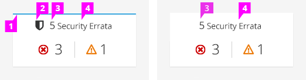
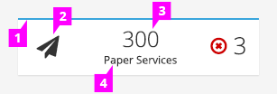
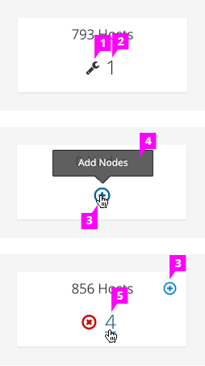
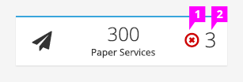

# Aggregate Status Card

## Header Area

  1. **Top Accent** (optional)**:**
    - If the aggregate status card is located at the top of a dashboard view, you may opt to add the the blue stripe to the top of the card. If the card is located somewhere other than a dashboard, there is no blue stripe.

  1. **Object Icon** (optional)**:**
    - An object icon can be used before the count and object name. Be consistent; either use the icon on all the cards throughout your application, or don't use it in any. Do not mix and match by applying icons to some cards but not others. Use icons thoughtfully and sparingly. Ensure that the icon’s symbol metaphor provides valuable meaning.
    Note: In the case of the mini card alternate, it is strongly recommended to use this object icon.

  1. **Total Number:**
    - This is a number that represents a count for the total number of objects in the environment.

  1. **Total Number:**
    - Include a label that states the object type.

## Content Area

  1. **Status Icon(s):**
    - This represents the status of the objects in the card. If everything is OK, one status icon for OK should be shown. Otherwise, multiple status icons can be shown to represent each status. Note: In the case of the mini card alternate, it is recommended to limit this to one status icon due to space restrictions.

  1. **Number Count:**
    - This shows the count associated with the icon. In general, a number next to the OK icon is redundant since the total count is already shown in the header area. Therefore, an OK status should be visually represented by an icon only. Alternatively, a card, not located in the dashboard view, may require the number count to be displayed with the OK icon. Note: In the case of the mini card alternate, it is recommended to limit this to one number due to space restrictions.

  1. **Action Icon** (optional)**:**
    - If no objects exist, you may want to display the create or add icon, whichever is the primary action. Note: Currently, only one action icon is supported in this design.

  1. **Tooltips:**
    - Use tooltips as necessary. It is recommended that tooltips are used for the status and action icons.

  1. **Links:**
    - Blue text with an underline that appears on hover reinforces that elements are interactive.
