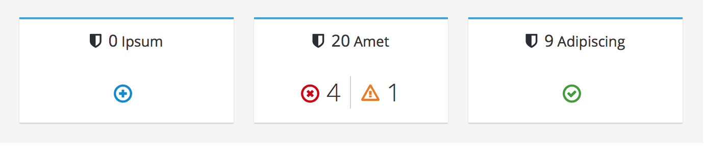
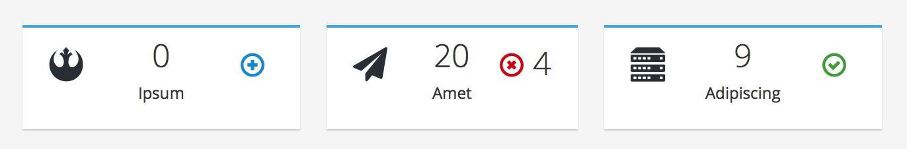

# Aggregate Status Card

The Aggregate Status Card shows a total number of objects and an aggregated status for those objects. The most common use case for this pattern is seen in a dashboard view to illustrate the total count and the status of objects in an environment. The mini card alternate can be used in the case when there is less space available for the status card as well as when there is less information to show in the card.

### Standard Card

### Mini Card Alternate

