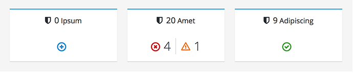
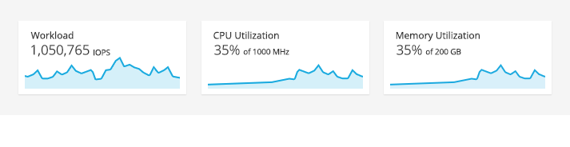
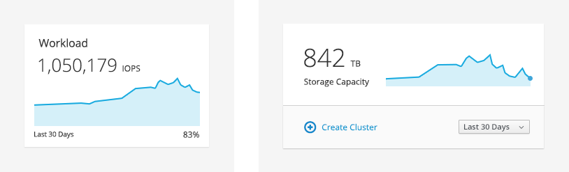
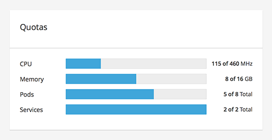
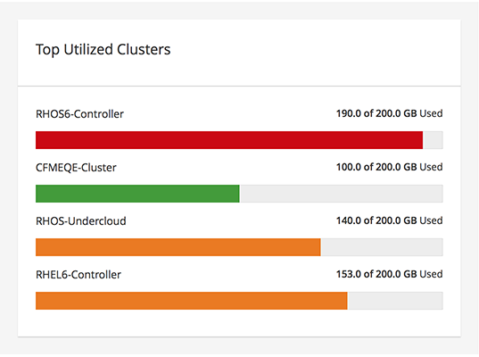
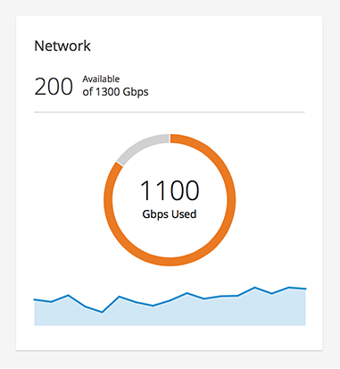
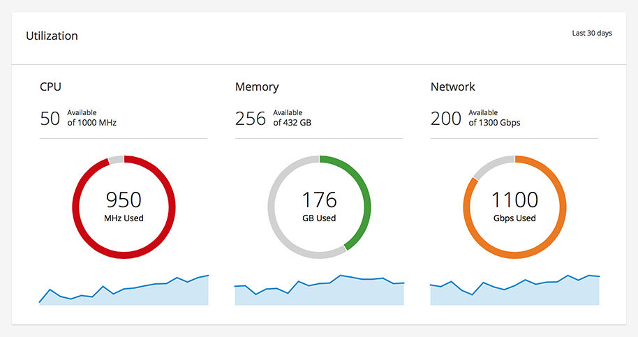

# Card

This section provides guidance on the base elements of a card. There a number of variations of the card. 

## Aggregate Status Card

[View the Aggregate Status Card Pattern](http://www.patternfly.org/pattern-library/cards/aggregate-status-card/#/api)

## Trend Card
### Small Cards

### Large Cards

[View the Trend Card Pattern](http://www.patternfly.org/pattern-library/cards/trend-card/#/api)

## Utilization Bar Card
### Top Left Description and Top Right Label

### Left Description and Right Label

[View the Utilization Bar Card Pattern](http://www.patternfly.org/pattern-library/cards/utilization-bar-card/#/api)

## Utilization Trend Card

[View the Utilization Bar Card Pattern](http://www.patternfly.org/pattern-library/cards/utilization-trend-card/#/api)
