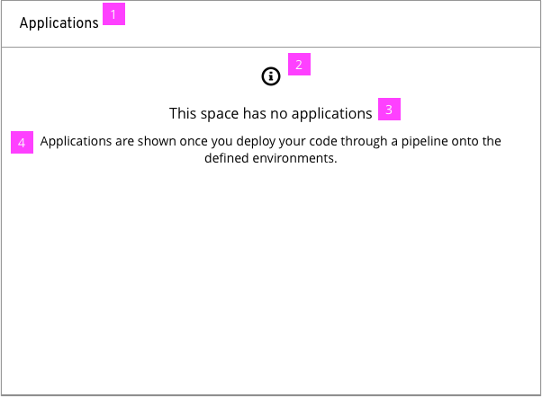
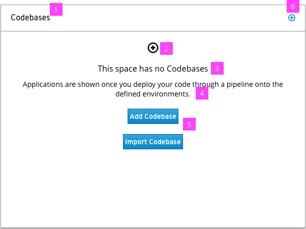

# Empty State Card with Information

  1. **Title:** Define a title for the card.

  2. **Set Empty State Type:** Set whether this is an informational state, notification state or actionable state.

  3. **Empty State Heading:** Set the heading for the empty state.

  4. **Empty State Description:** Set the description of the empty state. This should be informative enough for the user to understand why the Card is empty.

# Empty State Card with Primary Action

  1. **Title:** Define a title for the card.

  2. **Set Empty State Type:** Set whether this is an informational state, notification state or actionable state.

  3. **Empty State Heading:** Set the heading for the empty state.

  4. **Empty State Description:** Set the description of the empty state. This should be informative enough for the user to understand why the Card is empty.

  1. **Action Button(s):** Add buttons for the primary action of the card. In this example, the Card is notifying the user that Codebases need to be added in order for information to appear.

  1. **Quick Action:** Optional - enforces the Type icon and Primary Action.
