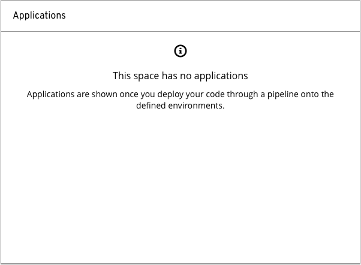
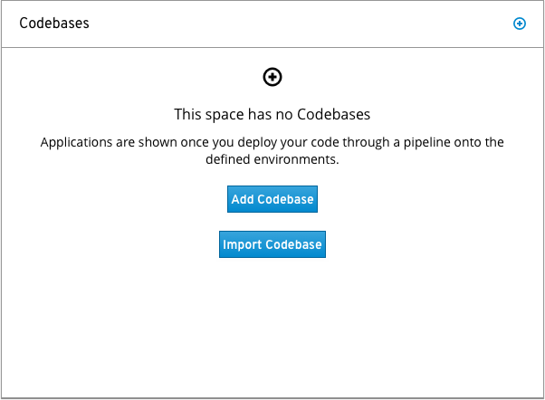

# Empty State Card

An Empty State Card displays the Empty State inside of a Card. The most common use is on a Dashboard, where data is displayed based on relevance or permission based data set.

Jump to [Empty State with Information](#empty-state-card-with-information) or [Empty State Card with Primary Action](#empty-state-card-with-primary-action)

### Empty State with Information

### Empty State Card with Primary Action

