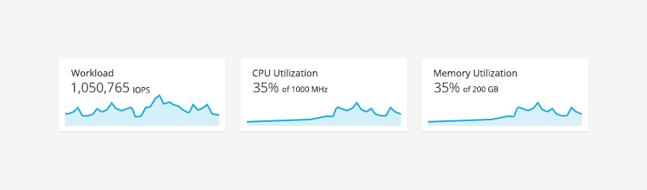
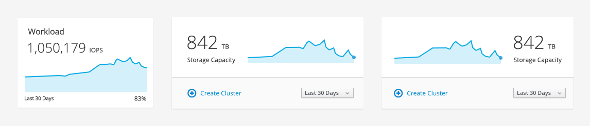

# Trend Card

## Overview
A trend card displays a trend of one or more metrics. The most common use case for this pattern is in a dashboard. For a single trend card, there are two different sizes of cards to choose from dependent on your application's needs.

Jump to [Small Cards](#small-cards) or [Large Cards](#large-cards)

## Examples

### Small Cards

### Large Cards

