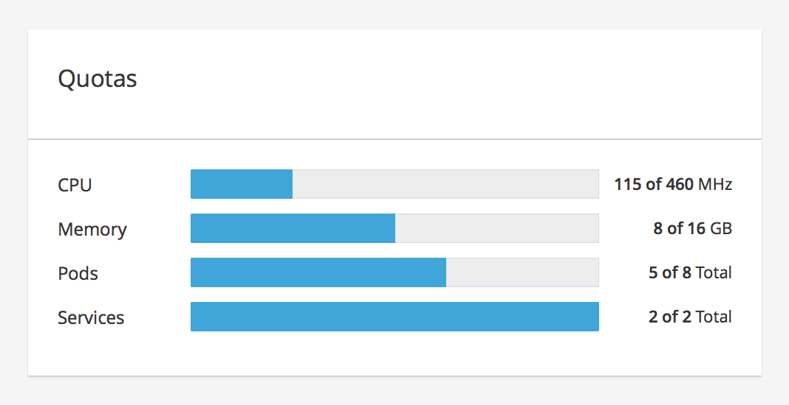
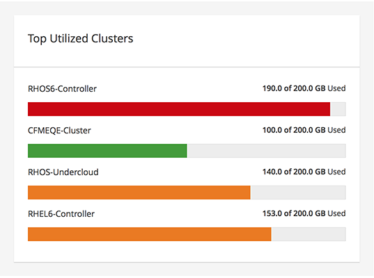

# Utilization Bar Card

A Utilization Bar Card displays the utilization for metrics using the [Utilization Bar Chart](https://www.patternfly.org/pattern-library/data-visualization/utilization-bar-chart/). The most common use case for this pattern is seen in a dashboard.

Jump to [Top Left Description and Top Right Label](#top-left-description-and-top-right-label) or [Left Description and Right Label](#left-description-and-right-label)

### Top Left Description and Top Right Label

### Left Description and Right Label

