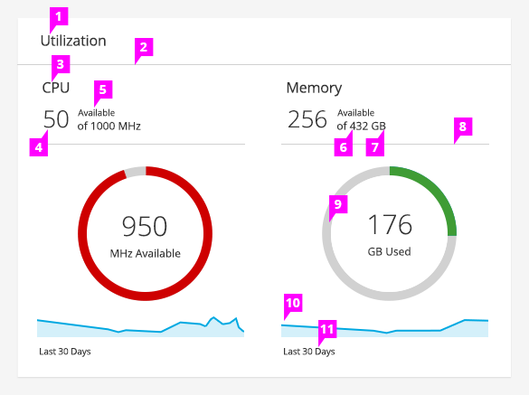

# Utilization Trend Card

## Card with a Single Metric

  1. **Metric Title:**
    - Display the metric name.

  1. **Current Value:**
    - Display the current value. This could be available, which is the PatternFly default, or used.

  1. **Label:**
    - The label for the value is left aligned and listed above the total value.

  1. **Total Value:**
    - The total value is left aligned and listed under the label.

  1. **Unit of Measurement:**
    - The label for unit of measurement is shown after the total value.

  1. **Content Separator:**
    - A horizontal line visually separates the content in the card. The content separator is located below the values and above the donut chart.

  1. **Donut Chart:**
    - See the [Donut Chart Pattern](https://www.patternfly.org/pattern-library/data-visualization/donut-chart/) for more details.

  1. **Sparkline:**
    - See the [Sparkline Pattern](https://www.patternfly.org/pattern-library/data-visualization/sparkline/) for more details.

  1. **Time Frame** (optional)**:**
    - The time frame is indicated under the sparkline by small text and is left aligned.

## Card with Multiple Metrics

  1. **Card Title:**
    - Use a card title if multiple metrics are shown in one card.

  1. **Title Separator:**
    - Include a horizontal line under the card title.

  1. **Metric Title:**
    - Display the metric name.

  1. **Current Value:**
    - Display the current value. This could be the amount available (PatternFly default) or the amount used.

  1. **Label:**
    - The label for the value is left aligned and listed above the total value.

  1. **Total Value:**
    - The total value is left aligned and listed under the label.

  1. **Unit of Measurement:**
    - The label for unit of measurement is shown after the total value.

  1. **Content Separator:**
    - A horizontal line visually separates the content in the card. The content separator is located below the values and above the donut chart.

  1. **Donut Chart:**
    - See the [Donut Chart Pattern](https://www.patternfly.org/pattern-library/data-visualization/donut-chart/) for more details.

  1. **Sparkline:**
    - See the [Sparkline Pattern](https://www.patternfly.org/pattern-library/data-visualization/sparkline/) for more details.

  1. **Time Frame** (optional)**:**
    - The time frame is indicated under the sparkline by small text and is left aligned.
