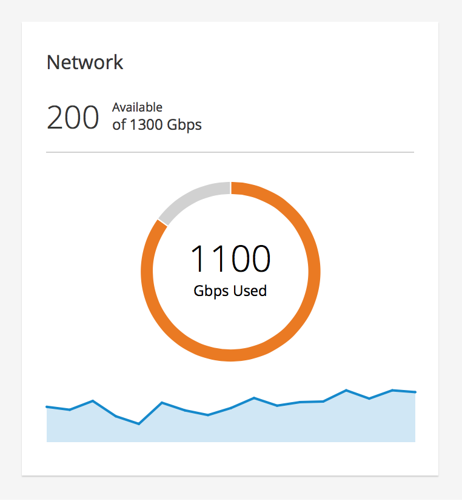
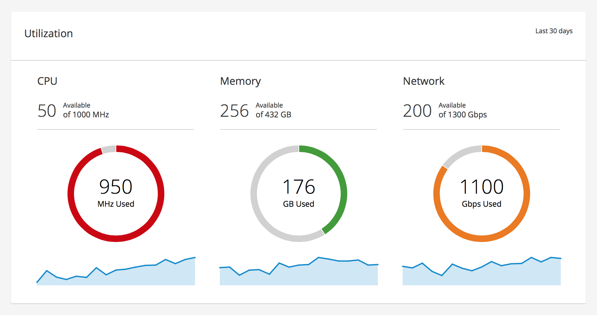

# Utilization Trend Card

Utilization cards display the current utilization and a trend of a single metric. The most common use case for this pattern is seen in a dashboard.

Jump to [Card with a Single Metric](#card-with-a-single-metric) or [Card with Multiple Metrics](#card-with-multiple-metrics)

### Card with a Single Metric

### Card with Multiple Metrics

