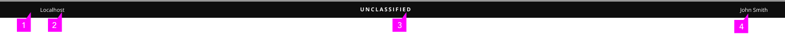

# Classification Banner

Classification banner is used to display classification level on the top and bottom parts of the display screens/webpages. When an information system is deployed into the U.S. Government, it must be approved of what type of data to process, such is data classification. Classification banner communicates what type of data users are working with. 

## Classified Banner
<!--  -->
* **Classification Level:** The classification level title indicates the screen/webpage as classified, unclassified or of any prietary level (Prietary Level I, Prietary Level II). Background color of the banner changes correspondingly with classification level.
* **Host Name:** Host Name is shown in a box at the right of banner.
* **User Name:** User Name is shown in a box at the right of banner, next to Host Name.

### Variations

* Banner showing varied classification levels
- Classified banner

- Unclassified banner

- Proprietary Level

* Without bottom banner

* Cancellable banner
Use when users of some screens/webpages are allowed to cancel out the classification banner.

