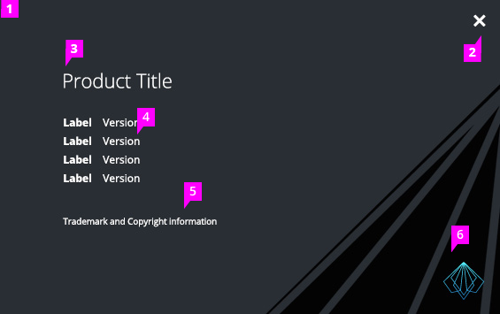

# About Modal

## Description

1. **Modal:** The About Modal leverages the existing modal in PatternFly. Upon opening the modal, the background behind it should “dim” in order to provide a focused view, reducing confusion. The modal should use the default position, top and centered on the screen.
1. **Close Button:** Clicking the close button (pficon-close) will dismiss the modal and return the background to it’s original state.
1. **Content:** Title of product, label and version, and legal text are present. Adequate spacing and font weight consideration should be provided for legibility. Two columns are available for versions that contain both a release name and version number or in the event more space is needed.
1. **Corner Graphic:** Corner graphic allows the opportunity for branding.
