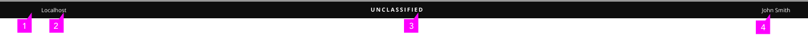
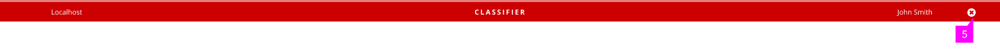
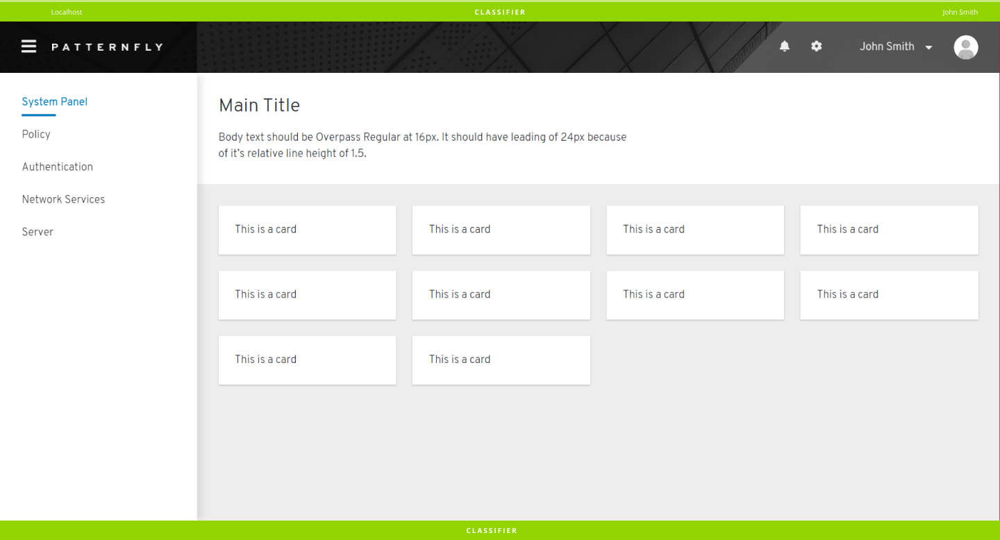

# Classification Banner

Classification banner is used to display classification level on the top and bottom parts of the display screens/webpages.

## Classified Banner

1. **Top Banner:** Body of the banner. Background color of banner can vary with Classification Level, or configured with Hex Color Code, Color name, or RGB Color Code.

    The background color can be set to any supported CSS color, because governments or organizations set standards and policies for different types of color backgrounds for certain types of data. Patternfly and other UX standard's color palettes may exclude the expected background color.

2. **Host Name:** Host Name is shown in a box at one side of the banner. The Host Name box can be configured for the left or the right side of the banner. Display of Host Name is optional.

3. **Classification Level:** The classification level title centered on banner indicates the screen/webpage as classified, unclassified or of any proprietary level (Proprietary Level I, Proprietary Level II). Text of title should match background color as shown in table below, but is configurable. 

    | Banner Color | Classification Level |
    | --- | --- |
    | Green | Classified |
    | Red | Unclassified |
    | Blue | Proprietary Level |

4. **User Name (Optional):** User Name is shown in a box at one side of banner next to the Host Name box. The User Name box can be configured for the left or the right side of the banner. Display of User Name is optional. It is recommended to disable User Name when it is already shown in Masthead.

    

5. **Close Button (Optional):** Close Button is shown at the right of banner, allowing users to hide classification banner at any time. Close button is optional.

6. **Bottom Banner (Optional):** Bottom Banner helps users to see classification level at bottom of screens/webpages. Main color of Bottom Banner matches that of Top Banner. Host Name and User Name are not shown in Bottom Banner. Bottom Banner is optional.

    

