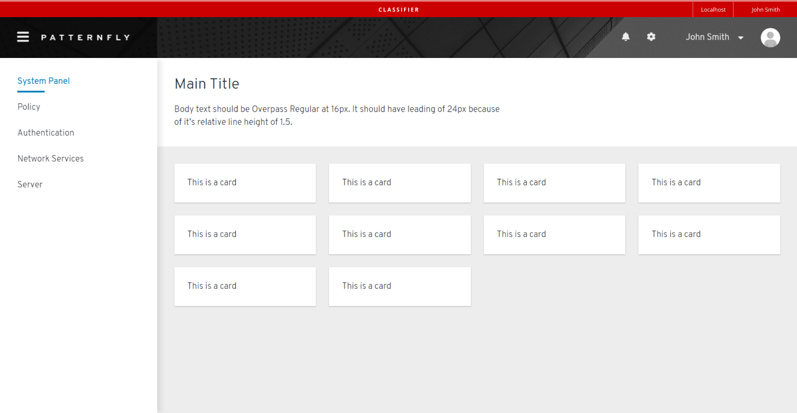
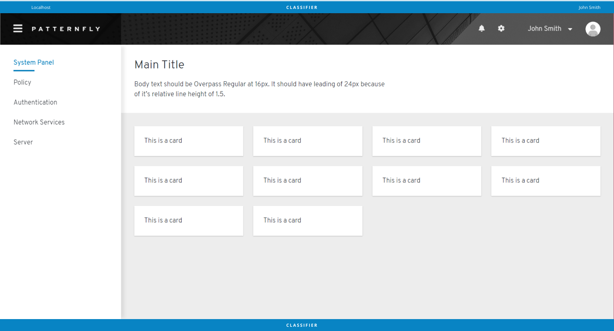
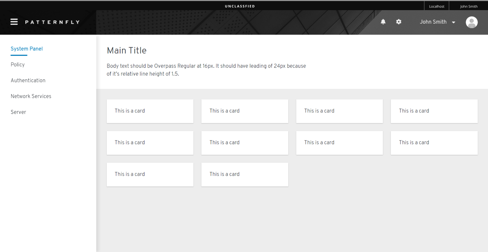
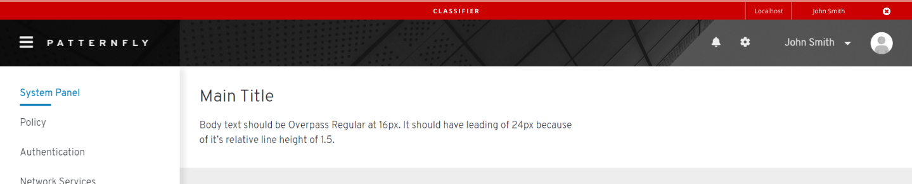

# Classification Banner

Classification banner is used to display classification level on display screens/webpages. When an information system is deployed into the U.S. Government, it must be approved of what type of data to process, such is data classification. Classification banner communicates what type of data users are working with. 

## Use Cases

Data classification banners can be used in any screen/webpage, or enabled in Masthead and Navigation elements.

## Variations

### Banner with bottom banner

Use when the screen/webpage extends in length vertically to make it easier for users to track classification level.

### Banner showing varied classification levels

1. Classified banner

2. Unclassified banner

3. Proprietary Level

### Without bottom banner

### Cancellable banner

Use when we want users to be allowed to cancel out the classification banner.

