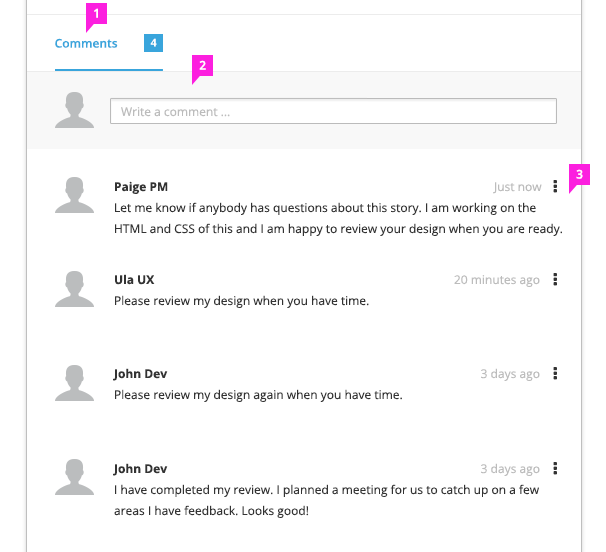
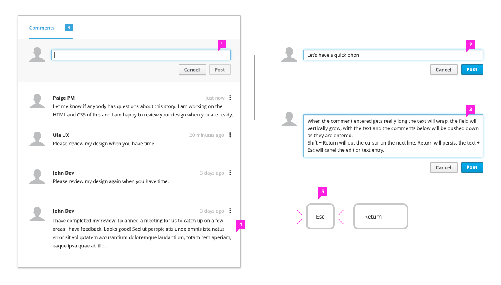
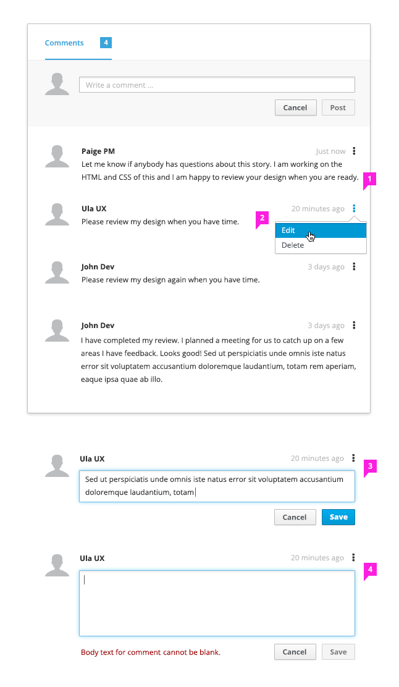
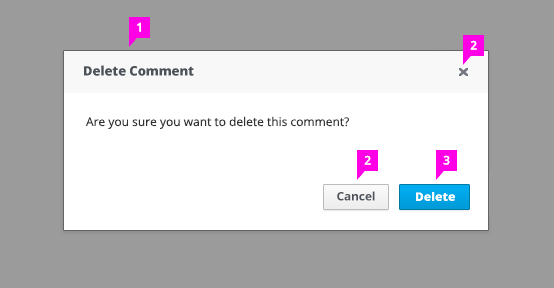

# Comments

## Creating and Viewing Comments

1. **Header:** The Comments header tallies the total comments. There is no known limit to the number of comments.
2. **Commenting Entry Field:** Placeholder text in the comment field will instruct the user on entering comments into the field.
3. **Comments:** 
    - Comments should be listed in either descending (default) or ascending order.
    - Each individual comment listed will contain:
        - The user's avatar. If the user does not have an avatar, a default avatar should be displayed. (Optional: An avatar displayed alongside the comment entry field) 
        - The user's name.
        - A date and time stamp that represents when the comment was entered or last modified. The format may vary, and should match the format of the existing application.
        - The comment text.

## Interactions and Behaviors for Entering a Comment

1. **Focus:** Once the comment field has focus:
    - The Cancel and Post buttons will display and the placeholder text will clear, displaying a blinking cursor.
        - The buttons may contain text or icons.
        - The buttons may be placed below or to the right of the text entry field.
        - The Cancel button is optional, as pressing "Esc" will achieve the same effect.
    - The Post button will be disabled by default, and will only enable when the text entry field contains at least one character. The Post button should change state as the user types in the text entry field.
    - If the text entry field is empty and loses focus, the placeholder text will reappear.
2. **Color:** The comment text should be black.
3. **Text Behavior:** The comment text should wrap to accommodate the text. The Post button will remain bottom aligned with the commenting text field as it grows.
4. **Alignment:** The comments should be left aligned and wrap onto multiple lines.
5. **Key Commands:** The "Return" return key will force a carriage return. The "Esc" key will Cancel the comment.

## Edit and Delete Comments

1. **Menu Commands:** The kebab menu will house the commands for the comment (e.g., Edit and Delete).
2. **Delete Command:** Selecting the Delete command prompts the user with a confirmation dialog.
3. **Edit Command:** Selecting the Edit command puts the comment in edit mode.
    * The text field will be highlighted and become an inline editable area.
    * The cursor will appear and have focus at the end of the comment text.
    * Save and Cancel buttons will appear.
5. **Empty Comment Field:** If the user removes all of the text from the comment and clicks the Save button, they will receive an inline message stating, "Body text for comment cannot be blank."

## Delete Comment Confirmation Dialog

1. **Displays When:** The Delete dialog displays after the Delete command has been selected.
2. **Cancel Actions:** The Cancel button and "X" will  close the dialog and dismiss any changes.
3. **Delete Action:** The Delete button will delete the comment.
4. **Keyboard Commands:** The "Esc" key will accept the Cancel action. The "Return" key will accept the Delete action.
5. **Other Actions:** Clicking outside of the dialog will dismiss the action and the dialog.

### What’s not covered in the current design:

1. Scrolling, as this action should be suitable to how and where comments are utilized. The comments may have a scroll bar or may be infinite scroll, depending upon how they are being used.
2. Replying to or threading a comment.
3. File attachments.
4. We have only provided placement of the date and time stamp format and rules, as requirements for these can greatly vary.