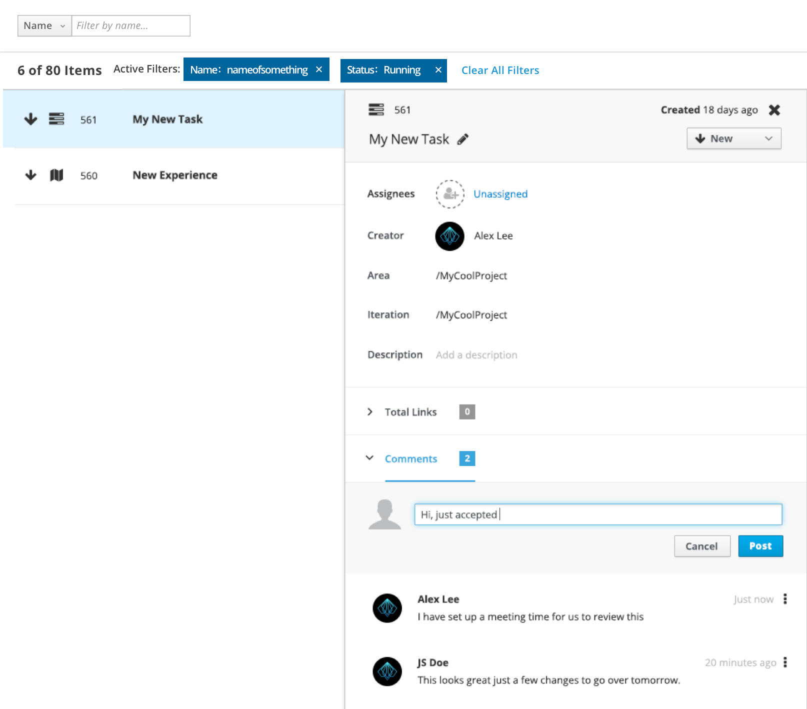

# Comments

Comments are a mechanism for collaboration and communication, allowing for ideas and decisions to be captured and tracked in one common place. Comments can be used in various places within an application.

