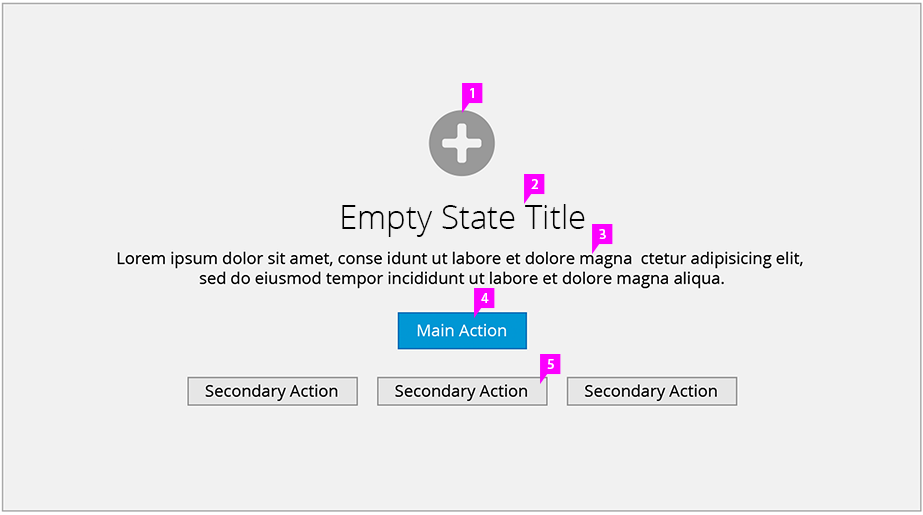

# Empty State

## Description

1. **Icon** (optional)**:** If an object icon is associated with this view, it can be displayed here.
1. **Empty State Title:** Give it a name.
1. **Text** (optional)**:** This text should be personal and helpful. It should minimize the user’s effort to complete tasks.
1. **Primary Action Button:** The primary action is displayed as a prominent blue button. See the [Action Labels](http://www.patternfly.org/styles/terminology-and-wording/#action-labels) section for more information about terminology and wording specific to action labels.
1. **Secondary Action Buttons** (optional)**:** Secondary actions are alternative options for the user. They are shown as more subtle gray buttons and located below the main action. There can be more than one secondary action.
