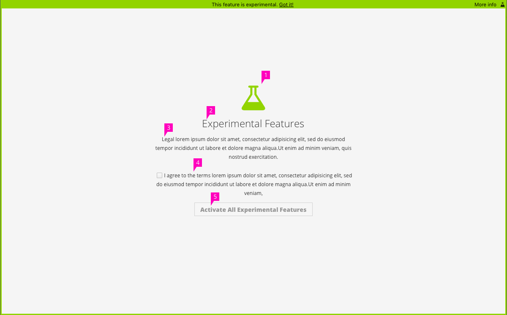
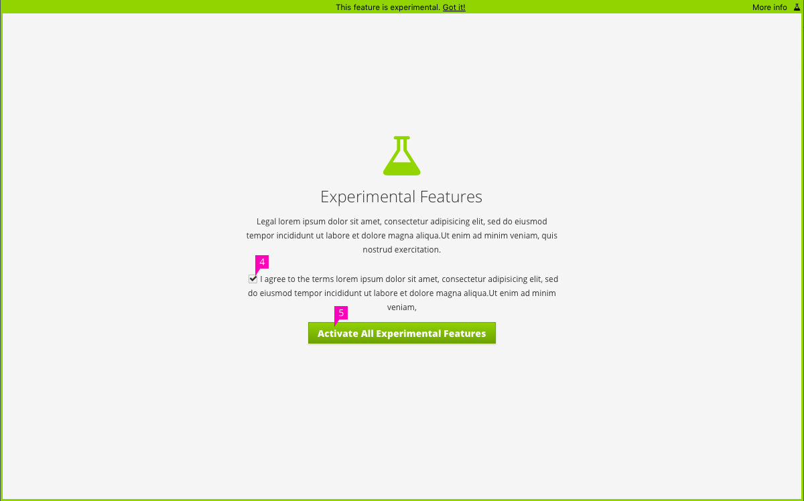
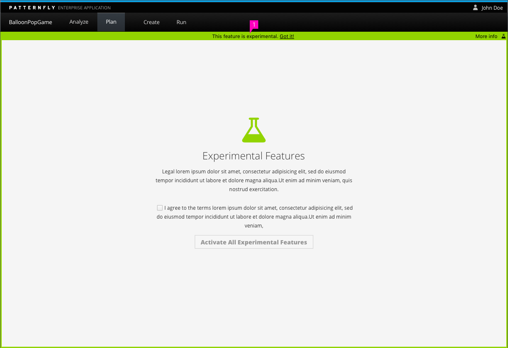
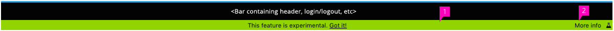
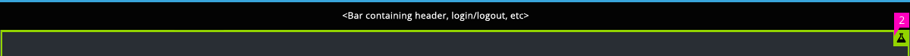

# Experimental Features

## Entry Screen

1. **Icon:** We utilize the flask icon from Font Awesome (fa-flask) to represent an experiment. This same icon can be used to indicate that a page or a feature is experimental.
2. **Title:** The title is given as "Experimental Features", but can be changed depending upon project requirements.
3. **Text:** This text should state what the experimental feature entails, as well as any information that you want to present to the user. We recommend that, at a minimum, you give a warning around an experimental feature and the level of stability or data longevity provided.
4. **Agreement Checkbox:** An opt-in checkbox with text that states the user agrees to use the experimental feature, with guidelines and/or warnings as stated in the above paragraph.
5. **Primary Action Button:** The primary action is displayed in a disabled state until the user accepts the agreement for using an experimental feature. Once that checkbox has been checked, the button transitions to a green button with white text.

## Entry Screen in Context

1. **Placement:** The experimental feature bar and border are placed around the content of the screen, even after the user has activated the particular experimental feature. It is designed to clearly delineate the differences between an experimental and non-experimental feature.
    - Any navigational items are still displayed so that a user can leave the experimental features screen without having to accept the terms agreement.

## Experimental Features Action Bar

The Action Bar is made up of two action items: "Got it!" and "More info".

1. **Got it!:** The "Got it!" text is a button link that is used to minimize the action bar. If you always want the bar to be displayed with the "This feature is experimental" text, you can remove the "Got It!" button and action. This should not be used in place of the term acceptance.

2. **More Info:** The "More info" link is utilized to see additional information on the experimental feature that the user is attempting to use. When the bar has been minimized, the flask button in the upper right will remain visible. This will allow the user to access more information on the experimental feature (if applicable), at any time during the use of the feature. Alternatively, this can just remain a static visual element if there is no further information to link the user to.
  - The default behavior should be that clicking on "More Info" would bring you to another page, explaining the experimental feature.
  - Optional: Add a tooltip to the "More Info" flask icon to remind the user of what they are clicking on.
