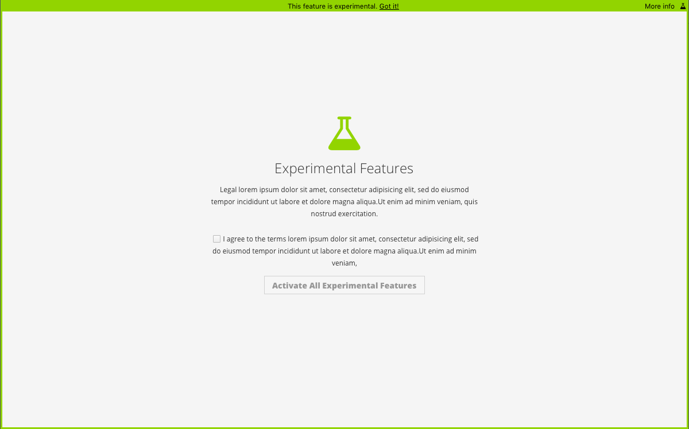
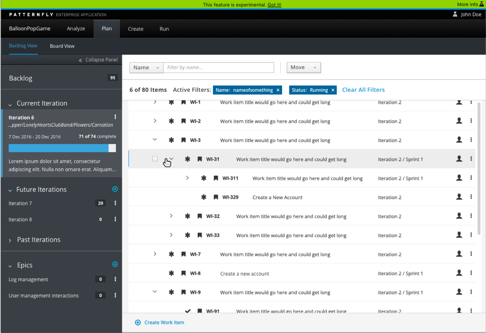
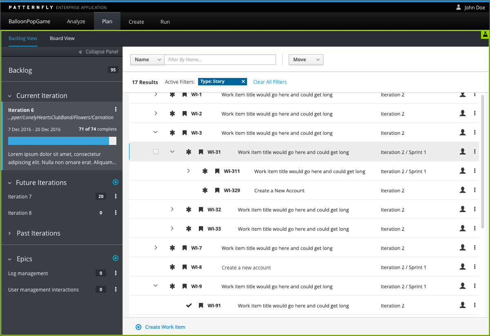
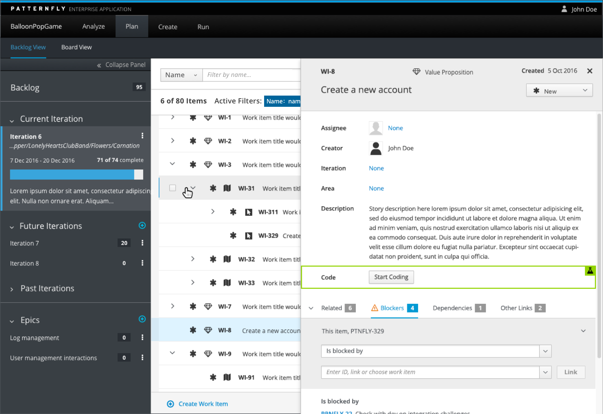

# Experimental Features

The goal of the experimental features pattern is to provide a notice to the user that they are entering an area of the application that may not be finished and is not considered to be the final release. Experimental Features are often items that, while still in progress, are released for use in order to collect information from users, as well as experiment with different patterns, interactions, visuals and development methods. An experimental feature flag is especially useful when you wish to test out alpha or beta features in a production environment, with real users.

This pattern should NOT be used when:

- You do not plan to ever remove the feature flag. Experimental Features are items that you are either experimenting with that will eventually become full features of your application, or items that will be removed from the system if they are proven to not work well.
- As a permission model. This pattern should not be used as a way to separate areas of the UI that might have limited permissions for the user.

### The experimental feature pattern can be utilized in three different manners:

##### Application Level:

##### Tab Level:

##### Component Level:

