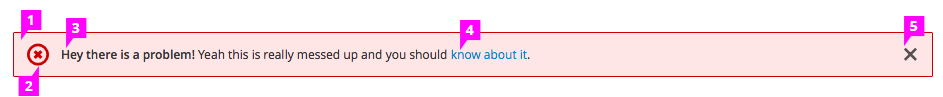

# Inline Notifications

1. **Background:** The notification should occupy the full width of the main content area. See the [In Context](https://www.patternfly.org/pattern-library/communication/inline-notifications) example.

1. **Icon:** Indicate the type of notification. There are four types of available notifications: info, success, warning, and error.

1. **Message:** Show a short message within the notification and make it clear what just happened or what the user needs to perform next.
  - Bold the important information (e.g., name of the object).
  - Use the regular font weight for the rest of the message.

1. **Link** (optional): Show a link to allow the user to navigate to details of the message.

1. **Close** (optional): Allow the user to dismiss the inline notification by clicking on the Close icon.
