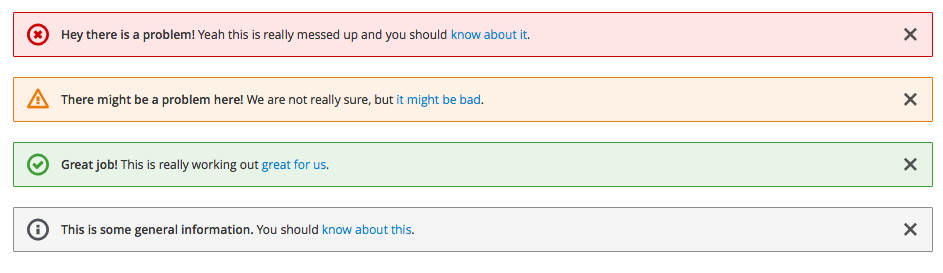
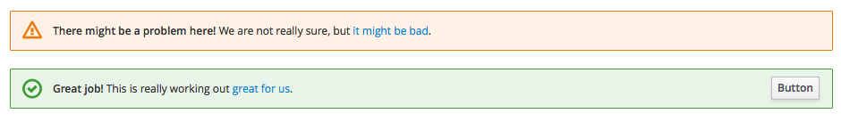

# Inline Notifications

Inline notifications are used to notify a user of the status of an action during a task flow. It is recommended that inline notifications are shown at the top of the main content area.

Jump to [Standard](#standard), [Variations](#variations) or [In Context](in-context)

## Standard

## Variations

## In Context

