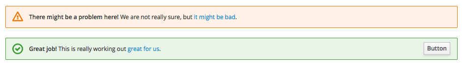
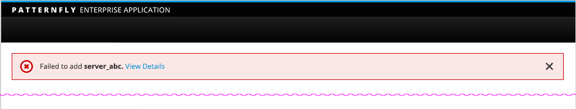

#Inline Notifications

Inline notifications are used to notify a user of the status of an action during a task flow. It is recommended that inline notifications are shown at the top of the main content area.

Jump to [Examples](https://www.patternfly.org/pattern-library/communication/inline-notifications/#/example-overview-1), [Variations](https://www.patternfly.org/pattern-library/communication/inline-notifications/#/example-overview-2) or [In Context](https://www.patternfly.org/pattern-library/communication/inline-notifications/#/example-overview-3)

## Examples

## Variations

## In Context

