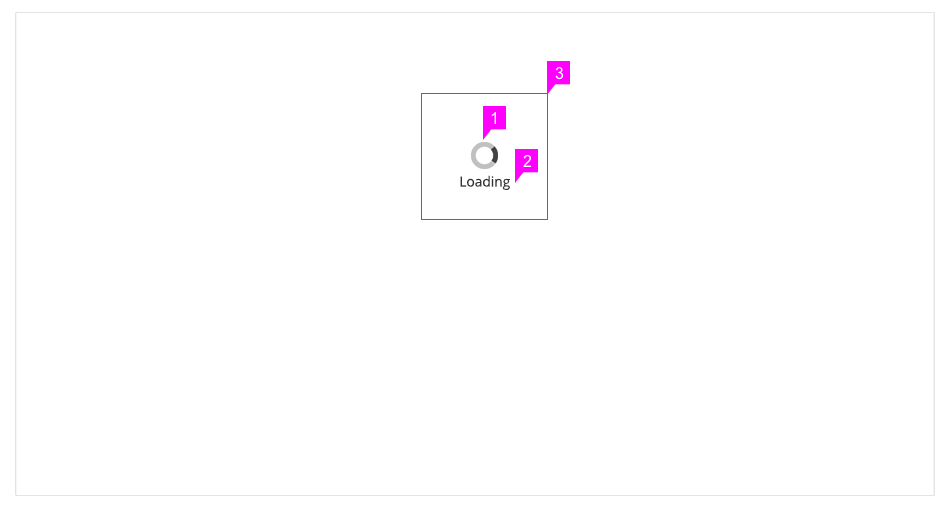
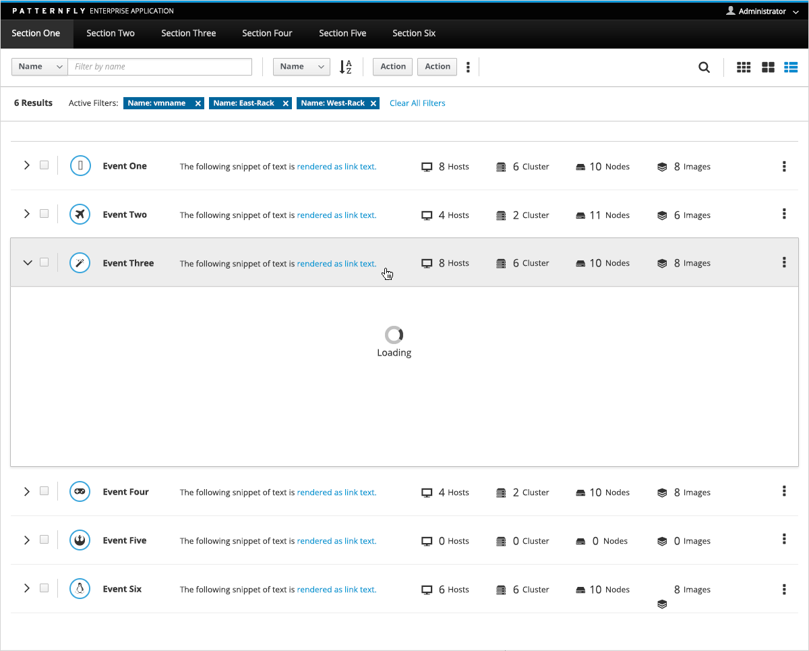

# Loading State

## Description

1. **Animated Spinner**:  [Loading symbol](http://www.patternfly.org/pattern-library/widgets/#spinner).

1. **Label**: The text is placed right under the loading symbol. The font size corresponds to the size of the icon.
1. **Alignment** : Both loading icon and text are centered middle.

An example of loading state in a list view.

