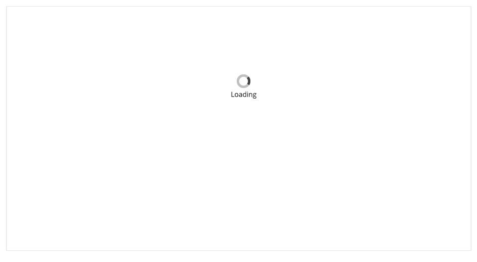
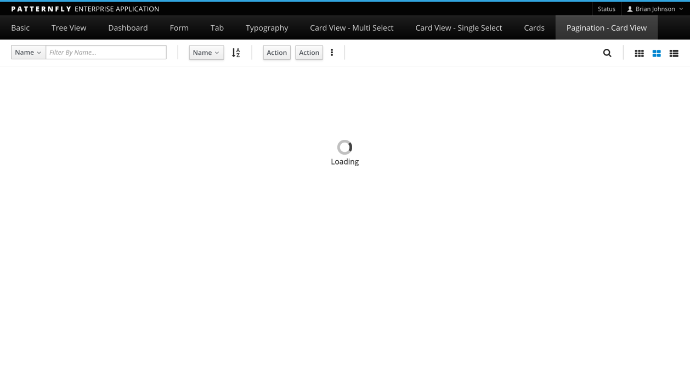

# Loading State

The goal of the Loading State pattern is to provide a visual clue that content is loading and the user has to wait before the view can be populated.

The empty state pattern is most often used in conjunction with one of the content views (e.g. [List View](http://www.patternfly.org/pattern-library/content-views/list-view/), [Table View](http://www.patternfly.org/pattern-library/content-views/table-view/), and [Card View](http://www.patternfly.org/pattern-library/content-views/card-view/)).  

