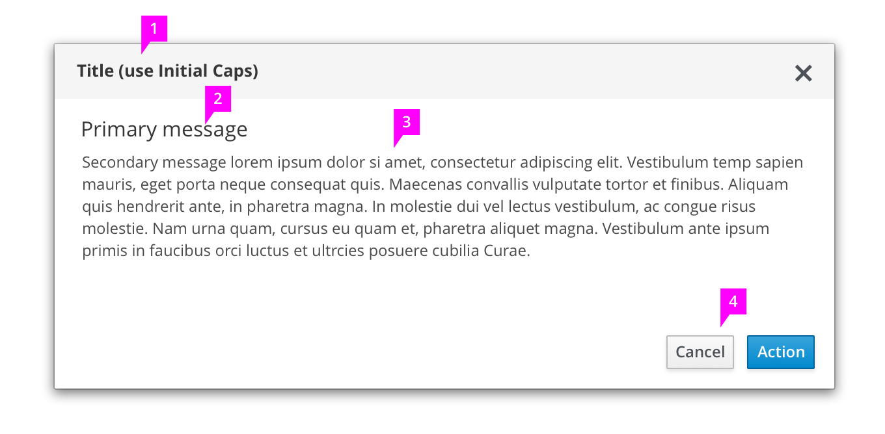
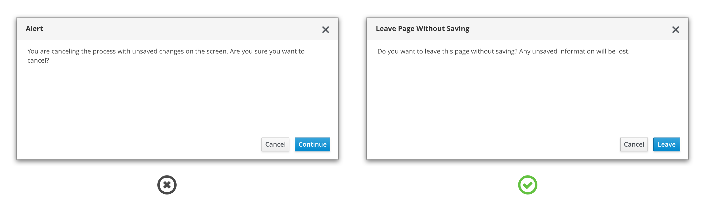
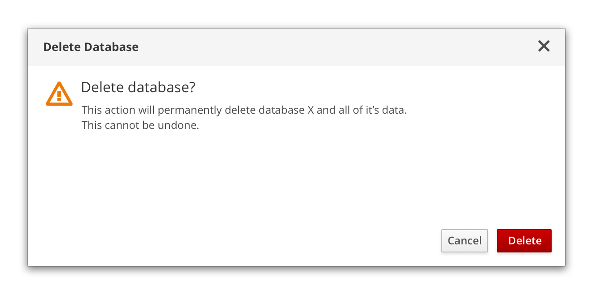
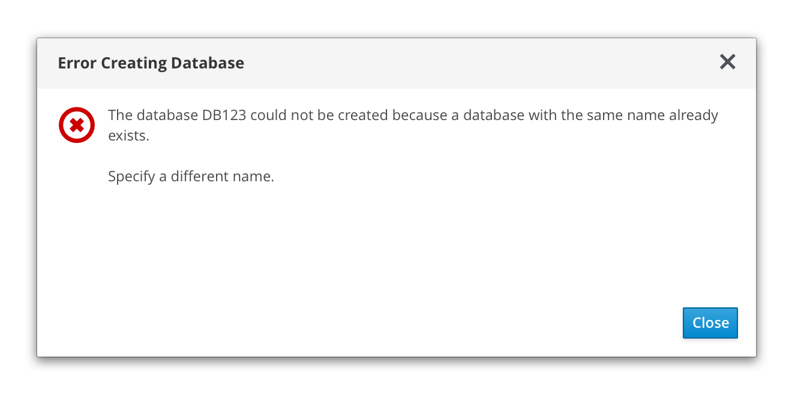
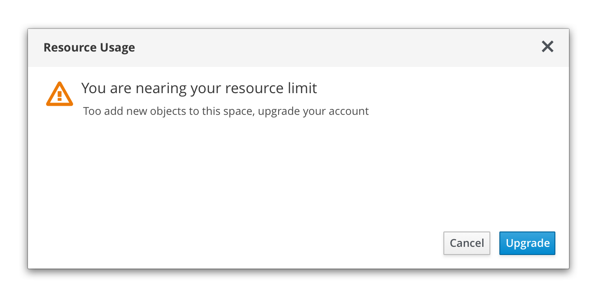

# Message Dialogs

## Elements of a Message Dialog

1. **Title bar (Required):** Titles are informative and effectively group the content in the dialog. Do not use general or ambiguous statements like alert, warning or Are you sure?

2. **Primary message (Optional):** Primary messages communicate critical information quickly. For example, an error message could contain a primary message stating “Wrong password” or “Could not remove user,” and body text that provides additional information about why the action failed and what the user might do next.

3. **Body (Required):** Body text is concise, actionable, and structured to be easily scanned and understood.

4. **Buttons (Required):** Buttons allow users to confirm or cancel an action, or acknowledge a message. Button labels help communicate the purpose of the dialog and enable users to make decisions quickly.

## Message Dialog Types

### Confirmation Dialog
Use a confirmation dialog to validate user decisions and communicate consequences. Confirmation dialogs need to clearly restate the action the user is trying to take and explicitly outline the consequences of that action.

**Note:** Since confirmation dialogs disrupt user task flow, do not provide confirmation dialogs for actions that are easily reversed or insignificant.

#### Confirm a non-destructive action
Provide buttons on confirmation dialogs that make it simple for users to understand and confirm their choices. When choosing button labels, use descriptive verbs that clearly indicate the consequence of a selection, like Delete, Save, or Create. Avoid vague labels like OK or Done.

Ambiguous title and button labels make it more difficult for the user to understand their options and make a decision.
Descriptive title and button labels make it easy for the user to scan the content and make a decision quickly.

#### Confirm a Destructive Action
Use a warning icon for actions that are difficult or impossible to undo. If an action will seriously impact the system and cannot be undone, use a destructive style button. Otherwise, use a primary button.

### Error Dialog
Use error dialogs to inform users of problems interrupting normal or expected behavior.

An error message should be actionable, human readable, and answer the following questions:
- What is the problem?
- Why did it happen?
- How can I fix it?

Never blame the user. Use passive voice where appropriate to avoid assigning blame.
- ⛔ You put in the wrong password.
- ✅ That password wasn’t recognized OR
- ✅ We didn’t recognize that password.

### Passive Dialog
Use passive dialogs to communicate critical information like the status of an application or result of an action. Passive dialog should clearly communicate the issue and any actions required of the user as a result of the issue. Information in a passive dialog should be important, immediately relevant, and either lead to or require action on the user's part.

Some usage examples include:
- Notifying a user that an operation may take a long time to complete
- Notifying a user that a critical process is complete

**Note:** If information is not critical, don’t use a passive dialog. Instead, use inline notifications or toast notifications.

## Message Dialog Status Icons

| Icon        | Use case(s)          | Usage |
| ------------- |:-------------:| -----:|
|  pficon-warning-triangle-o | **Warning:** Caution/ Warning of critical information|Use on confirmation dialogs or passive dialogs to indicate a higher level of urgency and importance.|
|  pficon-info| **Acknowledgement:** Informs the user of an action or result| Use on confirmation or passive dialogs to indicate a lower level of urgency.|
|  pficon-ok|**Success:** Alert the user that the action has been completed| Use on passive dialogs to indicate that a process has completed successfully.|
|  pficon-error-circle-o| **Error:** Alert the user that the action has been completed| Use on error dialogs to indicate a problem. |
