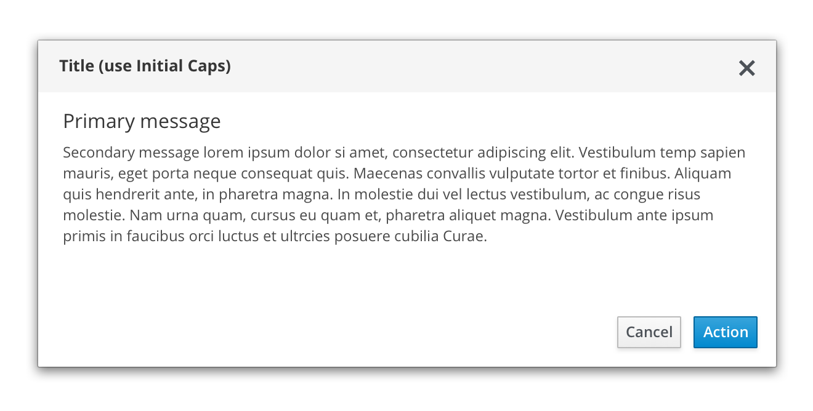

# Message Dialogs

Message dialogs give users critical information about a task.

Use message dialogs to:
- Validate user decisions
- Report errors
- Provide the result of a task or state of an application

## Message Dialog Variants
You can use a simple message dialog or provide a message dialog with a status icon.

### Message Dialog

### Message Dialog with Status Icon

### Status Icons for Message Dialogs
| Icon        | Use case(s)          | Usage |
| ------------- |:-------------:| -----:|
|  pficon-warning-triangle-o | **Warning:** Caution/ Warning of critical information|Use on confirmation dialogs or passive dialogs to indicate a higher level of urgency and importance.|
|  pficon-info| **Acknowledgement:** Informs the user of an action or result| Use on confirmation or passive dialogs to indicate a lower level of urgency.|
|  pficon-ok|**Success:** Alert the user that the action has been completed| Use on passive dialogs to indicate that a process has completed successfully.|
|  pficon-error-circle-o| **Error:** Alert the user that the action has been completed| Use on error dialogs to indicate a problem. |
