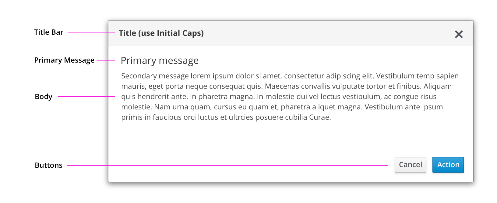
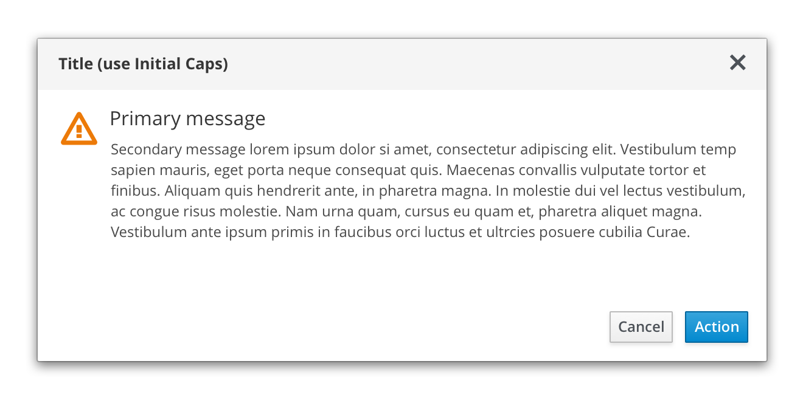

# Message Dialogs

Message dialogs give users critical information about a task.

## Usage
Use message dialogs to:
- Validate user decisions
- Report errors
- Provide the result of a task or state of an application

### Elements of a Message Dialog

 **Title bar (Required):** Titles are be informative and effectively group the content in the dialog. Do not use general or ambiguous statements like alert, warning or Are you sure?

**Primary message (Optional):** Primary messages communicate critical information quickly. For example, an error message could contain a primary message stating “Wrong password” or “Could not remove user,” and body text that provides additional information about why the action failed and what the user might do next.

**Body (Required):** Body text is concise, actionable, and structured to be easily scanned and understood.

**Buttons (Required):** Buttons allow users to confirm or cancel an action, or acknowledge a message. Button labels help communicate the purpose of the dialog and enable users to make decisions quickly.

## Message Dialog Variants
You can use a simple message dialog or provide a message dialog with a status icon.

### Message Dialog

### Message Dialog with Status Icon

### Status Icons for Message Dialogs
| Icon        | Use case(s)          | Usage |
| ------------- |:-------------:| -----:|
|  pficon-warning-triangle-o | **Warning:** Caution/ Warning of critical information|Use on confirmation dialogs or passive dialogs to indicate a higher level of urgency and importance.|
|  pficon-info| **Acknowledgement:** Informs the user of an action or result| Use on confirmation or passive dialogs to indicate a lower level of urgency.|
|  pficon-ok|**Success:** Alert the user that the action has been completed| Use on passive dialogs to indicate that a process has completed successfully.|
|  pficon-error-circle-o| **Error:** Alert the user that the action has been completed| Use on error dialogs to indicate a problem. |
