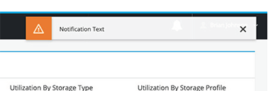
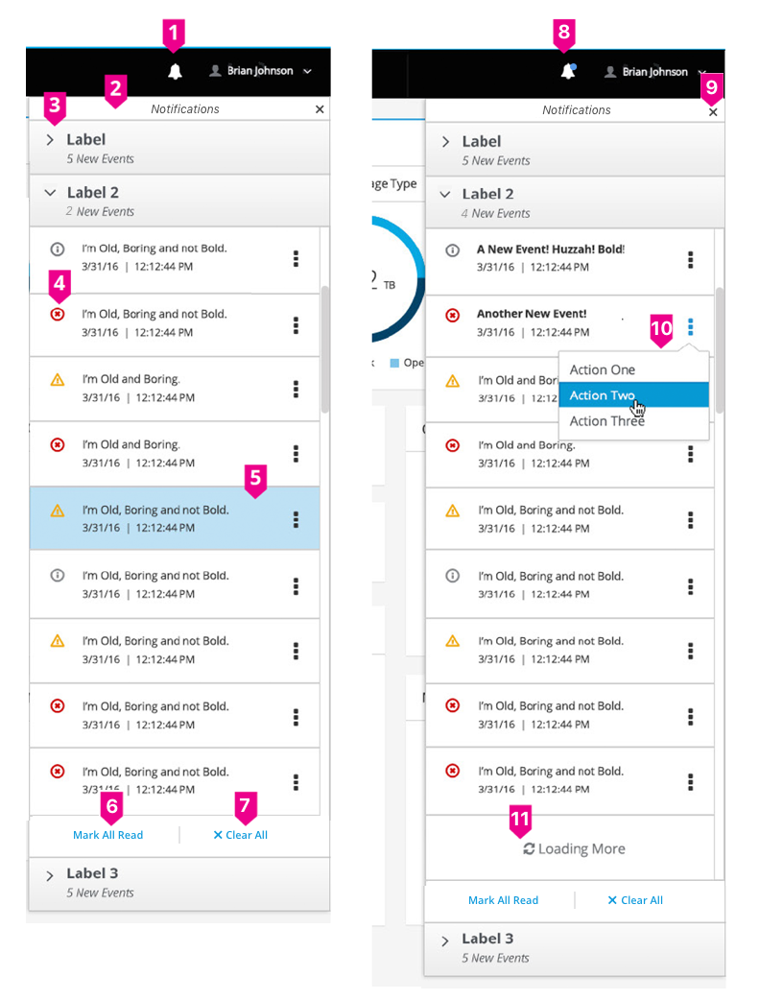
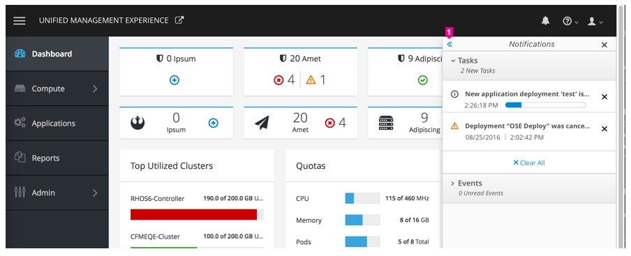
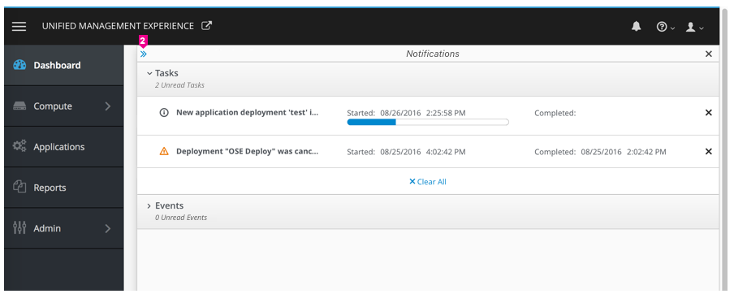
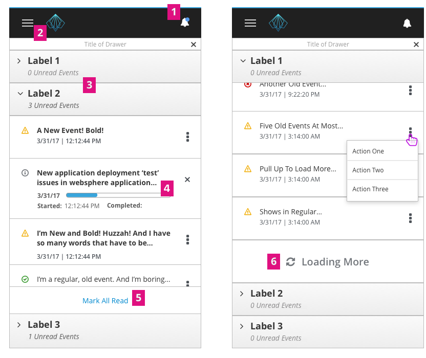

# Notification Drawer
Jump to [Toast Notification](#toast-notification), [Notification Drawer](#notification-drawer), [Expand Behavior](#expand-behavior-|-optional), or [Notification Drawer | Responsive State](#notification-drawer-|-responsive-state)

## Toast Notification

- **Toast Notification:** The drawer should utilize the current [Toast Notification](https://www.patternfly.org/pattern-library/communication/toast-notifications/#/api). The notification shows the title and an optional content-relevant icon.

## Notification Drawer

1. **Icon:**
  - The fa-bell icon should be used to represent the notification drawer.
  - Clicking on the icon will open a drawer from the top of the page.
  - Clicking on the icon again will close the drawer.
2. **Drawer Title:** Title of drawer.
3. **Accordion:** To maximize drawer space, only one notification tab may be opened at a given time. Italicized text will indicate the number of new events. Clicking on the title will toggle the accordion.
4. **Row:**
  - Each row has an icon specifying the type of notification displayed.
  - New/unread notifications are shown in bold.
  - Clicking on a row will remove the bold text and the item will be marked as "read."
5. **Row Hover State:** Example of hover state.
6. **Mark All Read** (Optional): Clicking “Mark All Read” changes all visible unread rows (bold row type) to read (regular row type).
7. **Clear All** (Optional): Clicking “Clear All” removes all visible rows from the drawer.
  - Note: This option may be used differently across products.
  - Some rows may not be eligible for clearing and should be determined on a case by case basis.
  - This link may be hidden as needed.
8. **Badge:** A blue badge will appear in the top right corner of the bell icon when new/unread notifications are present.
9. **Close:** A close icon should be shown in the top right corner of the drawer, providing another method for closing the drawer.
10. **Row Actions:** Clicking on the [Kebab](https://www.patternfly.org/pattern-library/widgets/#kebabs) menu will reveal a dropdown containing actions for that item.
11. **Infinite Scroll:** Allows the user to scroll through all notifications in the drawer viewport.

## Expand Behavior (Optional)
The notification drawer has the ability to expand in order to view additional details regarding an event. The expand drawer functionality is optional. Use of this feature will depend on the amount of information available.

### Collapsed Drawer

- **Collapsed Drawer:** The expand icon is in the top left corner of the notification drawer and is shown as a link to expand the drawer.

### Expanded Drawer

- **Expanded Drawer:** Individual rows may include additional information when in the expanded state. The collapse icon is in the top left corner of the notification drawer and is shown as a link. All other notification drawer features should remain the same as the collapsed view.

## Notification Drawer | Responsive State
This is how the notification drawer looks on small screens. The icon of notification drawer is exposed on the navigation bar and the drawer will take over the whole screen width.

1. **Bell Icon:** The bell remains in the banner, allowing the user to toggle the visibility of the notification drawer.
2. **Hamburger Icon:** Since navigation is hidden under “hamburger” icon, clicking on the hamburger menu should first collapse the notification drawer (if visible), and then display the navigation menu.
3. **Accordion:** All notification tab accordions are collapsed by default. When there are new notifications, only that tab, or the first tab in a list of tabs with new notifications, will be open. 
4. **Additional Information:** Individual notifications may include additional information about the event. The user can tap on the event name to toggle the visibility of the additional information. This will also mark the notification as read if it was previously unread. Tapping on another notification event will collapse any previously expanded events, as only one event may be expanded at a given time.
5. **Mark All Read:** After clicking “Mark All Read”, the link will be hidden until new unread notifications are available for reading.
6. **Loading More:** User can scroll up and down within an accordion to view more events. It will load 10 events at a time by default. When scrolling to the bottom of the list, user can pull up to load more events.
