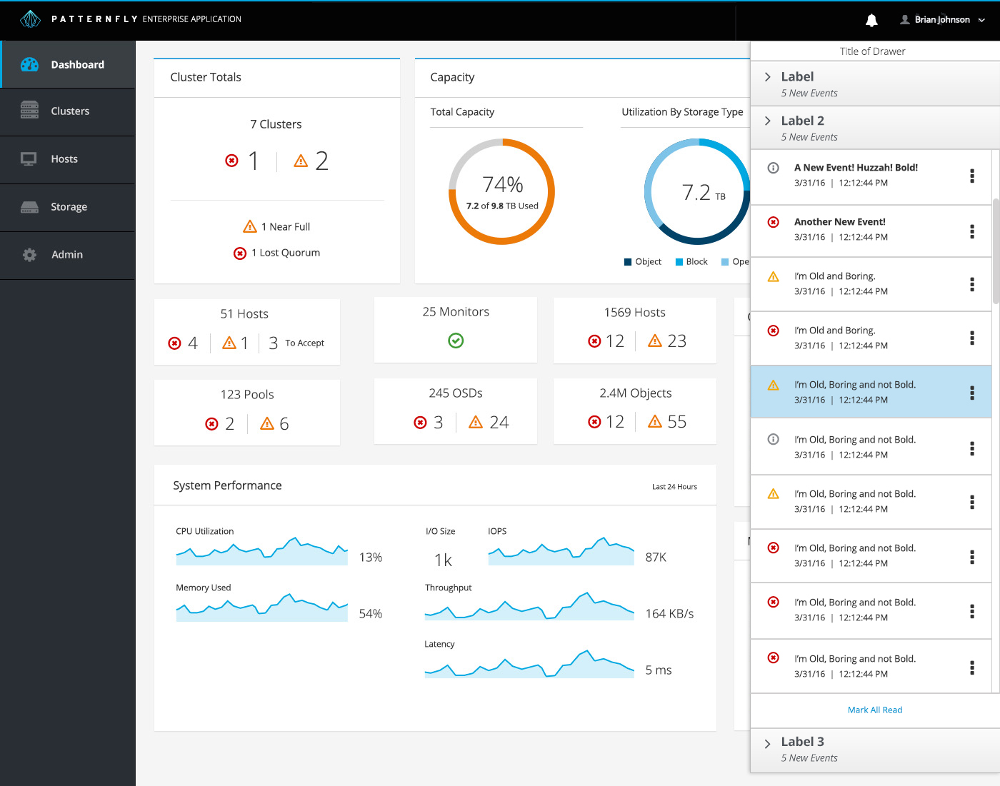

# Notification Drawer

## Overview

The Notification Drawer is a content delivery system such as events, tasks, and alerts. It is a self contained system that is viewable without having to navigate to another area of the application. Upon login it offers initial notifications for what has changed in the form of dismissible [Toast Notifications](http://www.patternfly.org/pattern-library/communication/toast-notifications/#/api) and a permanent interactive icon in the header bar. It is hidden or revealed at the user’s request.

Jump to [Vertical Navigation](https://www.patternfly.org/pattern-library/communication/notification-drawer/#/example-overview-1) or [Horizontal Navigation](https://www.patternfly.org/pattern-library/communication/notification-drawer/#/example-overview-2).

## Vertical Navigation

## Horizontal Navigation

