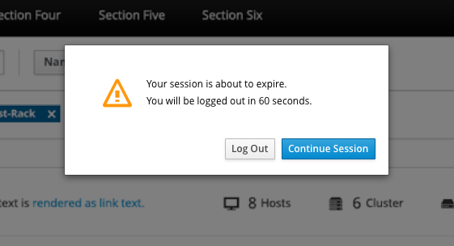
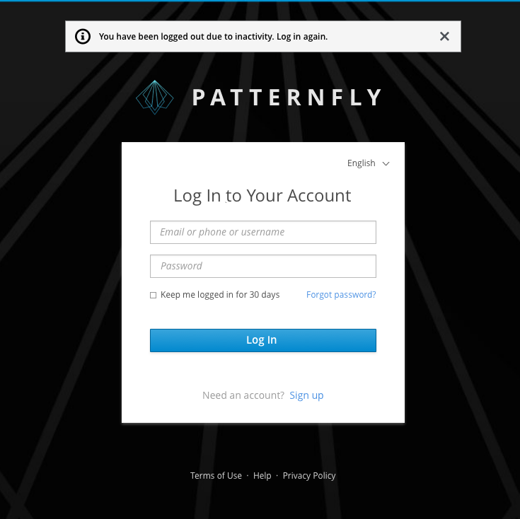

# Session Expiration Warning

The goal of a session expiration warning pattern is to provide a warning to the user that the current session is about to expire, and that the user will be logged out. The modal will be issued when there has been no activity after a specified amount of time.

If the user does not click "Continue Session" within the specified time, the user will automatically be logged out. If the user is logged out, they will be redirected to the Login Page with an inline warning notification stating "You have been logged out due to inactivity. Log in again."

