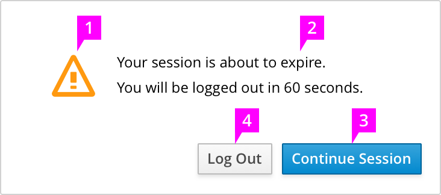

# Session Timeout

1. **Icon:** A warning icon should be used to indicate the type of this modal.
2. **Text:** This text should state the countdown time and will update as the timer counts down. When the timer reaches zero, the user will automatically be logged out and redirected to the Login page.
3. **Primary Button:** [The primary button](http://www.patternfly.org/pattern-library/forms-and-controls/buttons-on-forms/#design "Buttons on Forms") label should be "Continue Session".
4. **Secondary Button:** The secondary action should be  “Log Out”.

## Session Timeout Guideline

Sessions end after a specific amount of time passes. 30 minutes is the recommended session inactivity time. The recommended maximum session inactivity time is 4 hours.
